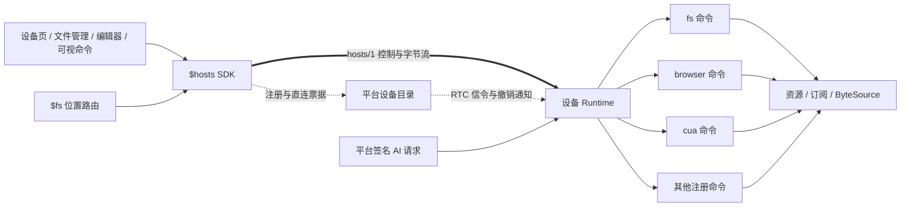

# `$hosts` 统一设备访问设计

> 2026-09-19 修订：文件访问增加服务器 NATS proxy，RTC 与 proxy 共用 hosts/1、fs/1 与设备 fs_policy；用户侧 run_tool 退出。入口、fs-only 范围、统一字节帧和迁移计划以 [RTC / Proxy 统一协议](../../aic/docs/hosts-proxy-protocol.md) 为准。本文下方的仅 RTC 传输约束已被该修订替代。

状态：实施中，2026-09-18，第二版设计。**整体替代上一版局限于“通用调用 + 可视扩展”的方案**，不受现有 fs 协议、SDK 或目录结构约束。本文描述目标架构；当前落地范围见下表，不能把目标接口视为已经发布的能力。

### 当前实施进度（第三批：Browser 设备窗口入口）

| 部分 | 当前代码与状态 |
|---|---|
| 协议与认证 | hosts/1、fs/1、短期票据 API、真实 DTLS 证书绑定、独立用途密钥、单次 data token、续租与撤销 |
| Runtime | provider catalog、独立 Session、恢复 token、Operation 去重/查询/取消、有界执行、操作实际停止后释放锁、当前授权复查 |
| RTC | `hosts-control` + `hosts-data` + `hosts-live` 三个可靠通道；64 KiB 控制帧、32 KiB 数据帧；文件使用 16 KiB credit，实时流使用整帧确认，二进制原始字节；大 JSON 自动转 ByteSource；周期回收 Session/流/授权 |
| 文件后端 | roots/home/stat/list/read/write/mkdir/remove/find/copy/move；有界分页、条件提交、目录操作明确部分结果；原始文件读写不经过 AI 文本格式化 |
| SDK | `$hosts.directory` 与按需共享连接；`$hosts.open()` 独立 Session、通用 command、Operation、HostPath、ByteSource；断线查询原操作，不自动重放修改 |
| 调用方 | 设备页、文件树/选择器、编辑器、上传、预览/下载均已迁移；元数据与内容分开、保存携带版本、分页显式消费、原始 CRLF/BOM 字节保留 |
| 内容桥 | `/host-content/<opaque-token>`，绑定创建页面/Session，Range/HEAD/取消，128 KiB 按需读取；完整下载完成即释放，没有固定 60 秒截断 |
| 旧实现 | 已删除 HostLink、fsChannel、HFS agent/run_tool 回退、rtc-media 模块和 SW；不再上报/缓存/返回 mgmt_code。设备成功启动 RTC 后宣告 hosts/1 |
| Browser | browser/1 普通命令；跨设备窗口发现；固定视口 JPEG 经通用 live 流主动推送；原始坐标输入直接转发；AI 与用户共享设备窗口并可同时操作；移除 iframe/nativeWin 路径 |
| 瞬时请求 | 命令目录 mode=request；通用 request 经 Session/认证/限流，不保留 Operation、不自动重放；高频画面/租约/输入使用此模式，输入安全由 provider 序列与租约约束 |
| AI 文件引用 | AI fs 直接使用设备原生绝对路径；file_url 保留 /fs/{host_id}/完整路径，不受工作区限制；AI 仍由服务器经 NATS 直接调用设备，不依赖前端 |

联合升级平台、页面与设备；未支持 hosts/1 的设备明确报升级错误，不做旧协议回退。设备导出 POSIX 文件系统根或 Windows 盘符，workspace 仅作初始目录，实际访问仍由设备权限逐项判定；macOS/Linux 支持安全字节读取、原子文件替换与移动；其他平台不宣告缺失方法。上传与复制单文件上限 512 MiB，目录枚举/递归操作预算 10000 条。目录复制为逐项提交，失败返回 completed/effect，不提供跨目录事务。文件范围读为版本验证，不保证跨进程强快照/CAS。

当前已实施通用 `mode: live` 双向流（live.open/input/ack/close、独立 hosts-live RTC 通道），Browser 通过 compositor paint 推送最高 60fps JPEG，单帧在途并仅保留最新待发画面；前端可选择 latest 模式，让接收与解码并行。设备端合并兼容的连续移动/滚轮，并保持离散操作的顺序屏障。输入不要求控制租约、画面版本或 AI 执行锁。尚待后续实施：持久状态 watch 订阅、更多资源 profile、cua provider、AI 到公共 Runtime 的完整入口迁移和更多平台原生实现。AI 仍以 ui/1 调用共享 provider，并未把 CLI/AI 对外协议整体替换。

验证入口：

- 设备：`go test -race ./protocol/hosts ./protocol/fs ./libs/hostcmd ./libs/hostfs`；`go test -race ./libs/host -run 'TestCommandService|TestAIFileReferences'`；`go test -race ./libs/rtc -run TestRTC`（需要本机 UDP）。
- 平台：`go test -race ./api/hosts ./libs/host ./models ./tools/fs ./libs/procs`。
- 前端：`node --test ui/hosts/*.test.js ui/assets/libs/fs.test.js ui/assets/libs/shortcut_fs.test.js`；修改模板运行 `vhtml check`。
- 可选真实浏览器：设置 `AIC_TEST_ELECTRON` 为 Electron 可执行文件、`AIC_TEST_UI` 为 aic/ui 绝对目录，再执行 `go test -race ./libs/host -run TestBrowserSDKLive -v`。测试使用临时工作区和本机 HTTP 信令夹具；SDK 的业务/字节流实际经过 Chromium 与 Pion 的 RTC 通道；同时挂载真实 vhtml Browser 页面，检查 AI 窗口发现、后台取图、输入、固定视口和查看器关闭后保活。

## 1. 结论：一个设备入口、一种调用模型、一套字节通道

`$hosts` 负责发现设备、建立经过授权的连接，并向前端提供设备能力。设备上的 `fs`、`browser`、`cua`、已注册程序及本地设置都是命令；它们使用同一套结构化调用、结果、操作状态、资源和订阅机制。页面、原生窗口、文件内容和进程输出可以具有不同语义，但不再各造一条通信链路。

确定以下取舍：

1. **机器协议使用 `command + method + args`**。argv 只用于确实以 argv 工作的原生程序，或作为人类/AI 指令的解析入口；不让前端把结构化参数拼成字符串再解析。
2. **文件内容永远是字节**。文本只是明确指定编码的 SDK 便利方法；行号、搜索摘要、截断提示属于展示层。文件、图片、截图、上传和媒体共用字节服务。
3. **结构化结果是唯一业务真相源**。取消 `JSON.parse(content)`、`attrs.status` 和从错误文本猜状态；AI 文本由同一结构化结果生成。
4. **设备记录、连接、调用上下文、资源各有生命周期**。设备在线不代表直连可达，关闭 UI 不代表关闭设备资源。
5. **前端可使用类型化便利接口，底层只有一条执行路径**。`host.fs.read()` 是通用命令的 SDK 包装，不是第二套后端文件协议。
6. **不保留永久旧接口**。联合升级前端、平台和设备；旧协议明确报需要升级，不静默回退到另一条执行链。

## 2. 现有问题与本次推翻的范围

基于当前代码核对：

| 当前设计 | 实际问题 | 新设计 |
|---|---|---|
| `$hosts.link(id)` 暴露 HostLink | 页面理解 RTC 就绪、call/callBin/writeBin 等细节 | 私有连接池，公开 HostSession |
| `$fs` 获取首个 agent，再创建 HFS | 访问本人设备文件被迫依赖 agent | 设备访问只依赖设备身份与权限 |
| fs.read 返回带行号、上限和截断的文本，HFS 再剥行号 | 适合 AI 阅读的结果被当成原文件；可能丢掉文件尾部或换行信息 | 原始字节读取；AI readLines 独立语义 |
| 图片走 attrs.image_data，二进制另走 readbin | 类型改变传输路径，调用方处理多种不一致结果 | 统一 ByteSource |
| 小文件整读、大文件 content=null、失败退回 meta-only | 调用成功却不一定有内容，错误被隐藏 | metadata、stream、buffered read 明确分开 |
| 文本 write 与二进制 writebin 分开 | 相同文件行为维护两套实现 | 同一个 fs.write，接收字节源 |
| readbin/off/len 与媒体 Service Worker 私有约定 | 预览与下载重复构建文件通道；seek 后缺少完整取消链 | 通用范围读取、流取消和资源 URL |
| home 依赖 ls，mkdir 不支持，rm 默认递归 | 基础文件操作含义不完整或有隐藏副作用 | 独立 roots/stat/list/mkdir/remove 方法 |
| 完整路径与快捷显示路径混用 | 容易把 workspace 相对展示误当成实际寻址 | 保留 `/fs/{host_id}/完整路径`，内部转换为卷 + segments；workspace 仅作初始目录 |
| RTC 专用 fs dispatcher 和壳专用调用链 | 权限、状态和流能力难以一致扩展 | 一个注册表和公共命令运行入口 |
| 主机列表包含 mgmt_code | 长期管理凭证进入页面数据缓存 | 短期、限连接的直连票据 |

代码依据：`aic/ui/hosts/{store,link,hfs,rtc_media}.js`、`aic/ui/rtc-media-sw.js`、`aic/ui/assets/libs/fs.js`、`aic-pod/libs/{rtc,host,vcore,proto}/`。

本方案重构 host 访问，不把 cloud/page 伪装为设备。`$fs` 可以继续负责跨后端文件定位和选择器，但 host 分支必须委托 `$hosts`；cloud/page 仅对齐文件 SDK 数据类型，不要求走 RTC。AI 对外 fs/exec 的表现形式可另行决定，其 host 执行最终进入同一运行入口。

## 3. 总体结构与责任边界



| 层 | 负责 | 不承担 |
|---|---|---|
| Directory | 设备登记、名称、启停、凭据轮换、所有权和票据 | 文件字节、命令结果中转 |
| Connection | RTC、认证租约、流量控制、心跳和重连 | 文件路径、browser 标签语义 |
| Session | 一次前端使用的上下文、操作记录、临时资源 | 云端 AI session 身份或权限 |
| Runtime | 注册表、参数校验、策略、调度、取消、去重和结果 | 前端布局 |
| Command provider | 实际能力，以及可选的资源、状态和视图 | 直接管理前端 RTC |
| UI / SDK | 类型化接口、渲染、输入采集、读取流 | 私自改变底层资源或推断执行成功 |

这些是职责边界，不要求每层拆一个空转 service。内置、进程内和独立进程 provider 共用同一声明模型。

## 4. 前端 API：从消费者使用方式反推

### 4.1 目录与连接

```js
const devices = await $hosts.directory.list();
const stop = $hosts.directory.subscribe(renderDeviceList);
await $hosts.directory.update(hostId, { name: "工作设备" });

// open 按需连接并创建独立调用上下文；同一页面同一设备复用底层 RTC。
const host = await $hosts.open(hostId, { label: "文件编辑器" });
const stopState = host.subscribeConnection(renderConnectionState);
const catalog = await host.describe();
```

Directory 提供 list/get/subscribe/create/update/remove/rotateCredentials。设备记录只包含身份、展示信息、presence 和能力摘要，不含长期管理密钥。`$hosts.get(id)` 只读本地设备视图，不偷偷建立连接。

`$hosts.open()` 每次返回独立 HostSession；内部连接池按账号 + host_id + credential_version 复用连接。没有消费者时空闲回收；设备列表刷新不再给所有在线设备自动建 RTC。登出、换账号及删除设备统一释放缓存、连接、URL、恢复令牌和输入状态。

### 4.2 文件

```js
const home = await host.fs.home();
const path = home.child("notes", "hello.txt");
const page = await host.fs.list(home, { limit: 100 });
const doc = await host.fs.readText(path, { maxBytes: 8 * 1024 * 1024 });

// doc.text 是原文，不含行号，不自动补换行；保存必须声明冲突策略。
await host.fs.writeText(path, editedText, { ifVersion: doc.version });
await host.fs.mkdir(home.child("empty-dir"));

const file = await host.fs.read(home.child("movie.mp4"));
const playback = await file.url({ purpose: "media" });
video.src = playback.url;
// seek 由通用 Range 桥驱动，不需要页面理解 readbin。
await playback.close();
await file.close();
```

默认 read 返回 ByteSource；readText/readBytes 是有明确内存限额的便利方法，超限报错并提示使用流，不返回残缺内容。writeText 仅编码，再调用同一个 write。`readText` 默认严格 UTF-8，保留 BOM 和换行；其他编码必须显式支持和选择，不根据文件后缀猜测转换。

### 4.3 命令、资源与视图

```js
const browser = host.command("browser");
const opened = await browser.call("open", { url: "https://example.com" });
const watch = await browser.watch({}, renderBrowserState);
const view = await host.views.open(opened.page, { profile: "surface/1" });
view.onFrame(renderFrame);
const control = await view.acquireControl();
// canvas 命中测试后，SDK 发送有序输入并维护按键/按钮释放。
await control.input(pointerEvent);

// 原生程序本身需要 argv，此时 argv 是该命令方法的结构化字段。
const op = await host.command("git").start("run", {
  argv: ["status", "--short"], cwd: home.child("project"),
});
const result = await op.result();

await view.close();       // 只关闭观看入口
await watch.close();
await host.close();       // 释放当前 Session，不关闭 device lifetime 的页面
```

`call(method,args)` 等价于 `start(...).result()`；两者只有一条 invoke 路径。Operation 提供 status/result/cancel/subscribe。`host.fs`、`host.views` 为 schema 对应的便利包装；业务页不能取得 DataChannel、绕过 Runtime 或调用 provider IPC。

## 5. 连接状态、信任与直连票据

### 5.1 分开记录 presence 和 connection

```text
presence:   online | offline | unknown          # 平台最近看见设备的状态
connection: idle → connecting → authenticating → ready
                            ↘ failed             ↓
                                              reconnecting → ready | failed
```

connection 包含 reason、retry_at、transport（rtc-direct；未来若提供 rtc-relay 则明确标记）。presence 过期仅作为发现提示，不关闭仍在正常工作的已认证连接；禁用、删除或撤销才触发关闭。重试按指数退避加抖动，受消费者需求和总连接预算控制；用户可以显式 reconnect。

当前实现 `iceServers: []` 的可达范围不变成方案的公网承诺。首版支持现有可达网络，STUN/TURN 是后续独立网络配置项。失败时报告不可达，文件读写和命令都不静默切到 agent/run_tool 中继。

### 5.2 用短期票据替代 RTC 管理码

1. 前端创建 PeerConnection 和 offer，通过平台 `POST /api/hosts/{id}/direct-tickets` 申请票据，提交 pc_id 和本端 DTLS 指纹。
2. 平台确认当前用户有设备管理权限、设备启用，签发限时、单次票据。建议入场有效期 60 秒；票据绑定 host_id、user_id、credential_version、pc_id、客户端指纹、jti 和到期时间。
3. 设备收到 offer 后，用 RTC 实际 remote description 的指纹校验票据绑定；客户端在控制通道 hello 中提交票据。设备验证签名、有效期、版本和单次消费，再返回 connection_id、runtime_epoch、限制与 data bind token。
4. 新票据使用从设备现有密钥派生的独立用途 K_direct（HKDF domain `aic/host/direct-ticket/v1`），不复用 K_tool。签名序列化与固定向量由平台和设备共享，页面永远不持有派生密钥；不自行设计另一套密码算法。
5. 连接授权租约建议 5 分钟，每 2 分钟刷新，刷新票据绑定原连接和主体。平台主动撤销即时生效；设备收不到撤销通知时至多保留到租约到期，不能声称断网也能立即撤销。平台暂时不可用时已有连接工作到授权到期。
6. 过期/撤销停止新调用和持续输出，释放输入，取消尚未执行的操作；已发生或不可取消的操作继续收尾并记账，不允许新请求借旧授权进入。恢复必须重新认证并查询结果。

设备本地管理 API 是否保留 code 是独立事务；本方案删除 code 在 RTC、设备列表和响应式状态中的传播。不加入每次操作弹窗，仍按当前管理权限和本地执行策略判断。

## 6. 统一协议 `hosts/1`

协议仍称 hosts/1：上一版尚未实施，不保留两个设计版本。使用三个 ordered/reliable DataChannel：`hosts-control` 承载命令和实时输入，`hosts-data` 承载文件字节，`hosts-live` 承载实时画面。它们共享 DTLS 身份和底层网络拥塞；分通道用于避免应用层相互等待，并不保证物理带宽隔离。实时流的有界缓冲和整帧确认限制积压。[WebRTC 标准](https://www.w3.org/TR/webrtc/#rtcdatachannel)

### 6.1 信封与错误

```json
{"v":1,"type":"request","id":"c:18","method":"invoke","params":{"session_id":"s_1","runtime_epoch":"rt_9","operation_id":"op_12","command":"fs","method":"stat","args":{"path":{"root_id":"filesystem","segments":["Users","name","notes","hello.txt"]}}}}
```

```json
{"v":1,"type":"response","id":"c:18","ok":true,"result":{"operation_id":"op_12","status":"succeeded","value":{"path":{"root_id":"filesystem","segments":["Users","name","notes","hello.txt"]},"name":"hello.txt","kind":"file","size":42,"version":"fv_5","media_type":"text/plain"}}}
```

```json
{"v":1,"type":"response","id":"c:19","ok":false,"error":{"code":"version_conflict","message":"File changed since it was read","details":{"current_version":"fv_6"},"retry":"never","effect":"none"}}
```

请求 id 只关联一次收发；operation_id 关联一个实际业务操作。请求错误表示未接收为操作；已接收后的业务失败记录为 operation status=failed + error，不能因为 response ok=true 就展示业务成功。

错误统一 `{code,message,details?,retry,effect}`。retry 为 never/reconnect/query_operation；effect 为 none/partial/unknown；SDK 使用 code 做分支，message 只展示。常见 code：unauthorized、permission_denied、unreachable、unsupported、invalid_argument、not_found、already_exists、version_conflict、resource_busy、stale_observation、stale_geometry、expired、overloaded、cancelled、deadline_exceeded。

事件为 `{v,type:"event",event,subscription_id?,stream_id?,view_id?,seq?,data}`。subscription.update/closed 携带 subscription_id；stream.item/cancelled/closed 携带 stream_id；view.surface/closed、control.lost 携带 view_id；catalog.changed 只携带新 revision。订阅序号和 epoch 由订阅类型解释。高频输入与流 credit 也走结构化控制帧，但不为每个鼠标移动创建持久 Operation。

SDK 只转换协议与已知类型字段的 camelCase/snake_case，命令自有数据、文件正文和对象键不得递归改名。未知方法、参数或必须能力明确拒绝；新增可选响应字段可忽略。核心方法的版本由 hosts/1 固定，命令参数由其 contract/schema 固定，不用同一个 agent_version 猜所有能力。

### 6.2 核心方法与业务方法分开

| 核心协议方法 | 用途 |
|---|---|
| hello / auth.renew / data.bind | 认证、租约更新、把二进制通道绑定到同一连接 |
| session.open / session.resume / session.close | 创建、恢复和释放调用上下文 |
| catalog.get | 分页能力发现；只返回声明和 schema，不执行命令 |
| invoke | 所有业务命令：command + method + args |
| operation.get / operation.cancel | 查询终态、请求取消；get 支持有界等待 |
| subscribe / unsubscribe | command state、resource state、operation progress 三种类型 |
| resource.describe / resource.release | 读取临时资源描述、释放句柄引用 |
| view.open / view.update / view.close | 可选展示入口、预览预算和关闭 |
| live.open / live.input / live.ack / live.close | 通用实时状态和有序输入流，无独占控制 |
| bytes.create / bytes.seal / bytes.read | 创建上传暂存、封存为字节源、读取字节源区间 |
| stream.credit / stream.cancel | 传输背压与取消 |

fs、browser、cua、settings 不出现在传输层 switch 中。比如 fs.stat 与 browser.open 都调用 invoke；fs.watch 也不新开特殊事件通道。

hello 以外的方法必须先认证；data.bind 使用 hello 返回的单次 token，绑定当前 PeerConnection、connection_id 和 runtime_epoch，默认 5 秒内完成。二进制通道认证前拒绝数据；控制连接结束时一并关闭。请求 ID 按发送方区分，设备只可反向发 stream.credit，不能要求网页执行业务命令；stream.item 由字节发送方发布，其他状态事件由设备发布。

首版建议限额：控制帧 64 KiB、含帧头的数据消息 32 KiB（取与实际 maxMessageSize 的较小值）、连接待发送 4 MiB、并发文件流 4、观看流 8；均由 hello 返回并在申请和分配内存前执行。单个大结构化结果以 JSON ByteSource 引用返回，SDK 解码；原始文件内容不受 JSON 内联阈值影响。

## 7. 命令声明与公共 Runtime

```json
{"name":"fs","contract":"fs/1","methods":{"stat":{"input_schema":"fs/1#stat","output_schema":"fs/1#entry","effect":"read"},"write":{"input_schema":"fs/1#write","output_schema":"fs/1#entry","effect":"write"}},"subscriptions":["directory/1"],"views":[]}
```

完整 catalog 包含 schema 内容或内容摘要绑定的可查询引用、方法版本、资源类型、订阅与视图 profile。schema ID 由 catalog 解析，不访问设备给出的任意外部 URL；catalog 变化通过连接级 catalog.changed 事件通知并使缓存失效。

```text
Declare() → 描述
Invoke(trustedContext, method, typedArgs) → typedValue / resources / error
Subscribe(trustedContext, selector, emit) → snapshot + updates    [可选]
OpenView / Input / Release → 资源能力                            [可选]
```

Runtime 统一做：身份与 Session → 已有操作查询 → 新调用的方法声明与参数验证 → 动态等级与本地策略 → 目标解析 → 原子登记/去重 → 共享调度 → provider → 结构化结果。排队后的执行点重新检查可变条件；已有操作的结果访问也执行当前读权限检查。effect 等描述是能力提示，不是客户端能提交的授权事实；实际权限和锁范围由设备解析后决定。

平台签名 AI 请求与直连管理请求各自验真，再进入同一 Runtime。浏览器 UI、AI argv、fs 工具都是适配入口；不能有一条路径直接执行 Provider.Run。当前 ui/1 的定位、动作、观察及结果语义可以复用，结构化参数直接进入其规范操作模型，CLI argv 在边缘解析一次。

原生程序仍按具体注册命令名授权，例如 git.run(argv,cwd)，不能增加一个可指定任意程序的 process.run 绕开 exec 策略。设备设置通过注册的 settings.get/update（含版本条件）处理，本地配置校验仍生效；平台设备名称与启停属于 Directory，二者不互相覆盖。

## 8. 文件模型：位置、元数据与内容分离

### 8.1 用户端完整路径与协议内卷寻址

**用户端文件访问接口始终为 `/fs/{host_id}/<完整设备路径>`。** 例如 `/fs/{host_id}/Users/name/file.txt`、`/fs/{host_id}/etc/hosts`、`/fs/{host_id}/C:/Users/name/file.txt`。不能将 workspace 注入完整路径、改成 root ID 链接，或以工作区作为全设备文件访问边界。

`fs.roots` 返回系统卷映射（POSIX `/`、Windows `C:/`、`D:/` 等），带 `native_path`。协议内部仍以 `{root_id,segments}` 精确传输文件名；SDK 根据映射在完整路径与内部位置之间转换。卷映射可用于构造路径，不授予列举或读写权限；即使卷根不可列举，已授权子目录仍可按完整路径访问。

```json
{"roots":[{"id":"filesystem","name":"/","native_path":"/","default":true,"path_style":"posix"}]}
```

`fs.home` 独立返回配置的初始目录，快捷选择器可将它显示为设备名下的默认目录；用户能通过完整路径访问其他获授权位置，也可向上浏览。更换 workspace 不改变已有完整路径链接的含义。`HostPath.child()` / `parent` 只构造位置，不隐式切换 cwd。

- 拒绝 `.`、`..`、空段、NUL 和该平台的目录分隔符；不展开 `~`、环境变量或 URL 编码，不把文件名中的 `%2F` 当 `/`。URL 编码在链接边界进行一次。
- 设备权限作用于具体原生路径；目录别名同时检查请求路径和解析后的目标，随后使用固定目录句柄打开，防止解析后被替换成链接。
- stat 返回链接本身；目录浏览支持经授权的目录别名；删除、移动操作链接自身。原始文件读取仍要求普通文件。根目录仍不可删除、替换或移动。
- 版本条件、分页、原始字节与资源生命周期属于通用协议升级，与用户端路径格式相互独立。
- 当前 AI 与前端有独立传输：服务器 → NATS → 设备命令入口；用户前端 → RTC → 设备直连接口。设备内实现可以复用，AI 永远不借道前端，也不依赖查看器在线。

### 8.2 元数据与文件列表

Entry 统一为 `{path,name,kind,size?,modified_at?,version?,media_type?,capabilities?}`。kind 为 file/directory/symlink/other；size 缺失代表未知，不以 0 代替。version 是设备产生的不透明变化标识，不是权限凭证，也不自动等于内容哈希或 HTTP 强 ETag。

| fs 方法 | 输入与结果 | 规则 |
|---|---|---|
| roots | 无 → roots | 系统卷到完整原生路径的映射，不授予文件访问权限 |
| home | 无 → path | 只提供初始目录，不限制寻址范围 |
| stat | path、可选 follow_symlinks → Entry | 只读元数据，不读内容 |
| list | path、limit、cursor、sort、hidden → entries、next_cursor、revision | 单层、分页；默认 100，上限由设备声明 |
| find | path、include、exclude、depth、limit、cursor → paths | 文件名/路径匹配，不复用文本搜索的空 pattern |
| search | path、pattern、mode、case、glob、context、预算 → matches | 明确 literal/regex，结构化命中、行号、范围和 truncated |
| read | path、可选 if_version、consistency、follow_symlinks → ByteSource | 不区分文本/二进制，不对目录隐式 list |
| readLines | path、start_line、max_lines、max_bytes → lines、range、truncated、version | AI/代码预览的明确文本窗口；不作为编辑器整文件接口 |
| write | path、source、condition、可选 create_parents → Entry | 字节源完整封存后提交；条件必填 |
| patch | path、if_version、edits → Entry | 基于原文件字节偏移的非重叠替换；统一写入提交 |
| mkdir | path、parents、exist_ok → Entry | 独立创建空目录；默认均 false |
| copy | src、dst、目标条件、recursive → Operation 结果 | 同设备执行，逐个检查源读取与目标写入权限 |
| move | src、dst、源/目标条件 → Entry | 默认仅原生同卷移动；跨卷返回 cross_device |
| remove | path、if_version、recursive、missing_ok → 删除结果 | recursive 默认 false；不隐式回收站或递归 |

文件列表不再默认返回整棵嵌套树。展开目录时分页读取；递归查找用 find。cursor 绑定 root、目录、查询条件与遍历版本，不能改条件继续使用；检测到目录变化时返回 cursor_invalid，UI 重新读取，不把新旧分页随意拼接。外部进程并发修改时普通 OS 目录枚举不承诺事务快照；需要强快照的后端另行声明能力。

search 返回 `{path,line,column,text,match_ranges,context_before,context_after}`，行号和 column 从 1 开始，column 按 Unicode scalar value 计数；原始字节区间从 0 开始。字节/时间/命中数都有预算；截断必须显式返回，不让调用方把部分匹配当成“没有更多”。regex 使用 Go regexp 支持的 RE2 语法，glob 的 include/exclude 分开，`*` 限单段、`**` 跨段，随 fs/1 固化；SDK 不在浏览器中用 JS 正则重新解释搜索条件。[Go regexp 语法](https://pkg.go.dev/regexp/syntax)

readLines 的每行是 `{number,text,ending}`，ending 为 lf/crlf/cr/none；只在 AI formatter 中添加行号。读取原始文本则一字节不改，不切 1000 行、不补尾换行、不隐藏空文件。

### 8.3 写入条件与完整性

write 的 condition 必须三选一：`{absent:true}`（新建）、`{version:"fv_5"}`（基于已读版本保存）、`{any:true}`（明确无条件覆盖）。SDK 分别暴露 createOnly、ifVersion、overwrite；不提供悄悄覆盖的默认值。rename/copy 的目标默认要求 absent，覆盖仍需明确条件。

absent 必须使用后端原生的无覆盖提交机制，不能用“先 exists，再覆盖式 rename”模拟；后端无法安全实现时拒绝该能力。版本条件的保证范围与下述 conditional_write 声明一致。

```json
{"command":"fs","method":"write","args":{"path":{"root_id":"filesystem","segments":["Users","name","notes","hello.txt"]},"source":{"id":"bytes_7","epoch":"bytes_rt9","kind":"bytes"},"condition":{"version":"fv_5"},"create_parents":false}}
```

写流程为：上传暂存 → 校验完整长度/摘要 → 校验目标与版本 → 在目标文件系统准备临时文件 → 必要同步 → 原子替换（后端支持时）→ 返回新 Entry/version。未完成上传的取消或断线不改变目标文件；fs.write 已被接受后可以在断线期间继续完成。跨越提交点时用 Operation 查询结果，不根据网络错误重新保存。

atomic_replace 与 conditional_write 分开声明。原子替换表示读者不看到半个文件；Runtime 锁 + 提交前版本检查只协调经过本 Runtime 的写入，**不能宣称能原子阻止任意外部程序在检查与替换之间写文件**。需要对所有写入方有强 CAS 的场景要求后端提供 atomic_cas，否则返回 unsupported 或明确接受 runtime_serialized 语义，不能把强需求静默降级。

版本检查、源版本检查和提交在同一 Runtime 锁范围内完成；目录别名与符号链接按真实目标协调。权限、现有文件 mode、平台替换限制和 fsync 持久化能力由后端明确处理，不通过删除目标再重建来伪装原子替换。patch 的 offset/delete_bytes 基于同一个 if_version 的原始字节；插入值为 ByteSource，编辑范围越界/重叠则整体拒绝。

copy/remove 的目录操作可能有部分效果，不能假装目录事务。结果列出 completed/failed/skipped 和失败位置，错误 effect=partial；取消保留已完成项。跨卷或跨设备“移动”由上层明确编排 copy → 验证目标 → 按原源版本删除，源删除失败保留两份并报告，绝不暗中做 copy+delete。

### 8.4 文件版本与读取一致性

fs.read 返回的字节源绑定打开的对象、大小、版本和一致性能力。普通文件默认 verified：保持文件对象句柄，读取前后检查可检测的变化；检测变化返回 source_changed 并终止流，不能在同一响应里悄悄换到新版内容。缓冲型 readText/readBytes 只有成功结束才返回数据。

普通文件系统无法仅靠 size/mtime 和打开句柄保证任意外部原地写入期间的事务快照；verified 不作此承诺。需要稳定快照时显式 consistency=snapshot，只有提供快照/不可变副本保证的后端接受，否则 unsupported。不能用一次普通 copy 的完成来声称在并发写入下得到原子的源快照。

immutable ByteSource（上传完成、截图产物等）可给出内容 SHA-256；可变文件的 version 不能被当作相同字节的强校验。范围重开和续传必须检查同一来源版本，变化后重新开始。

### 8.5 文件订阅

`host.fs.watch(path, options, callback)` 使用通用 subscribe，kind=command、command=fs、selector={path,recursive}，返回 directory/1 的首次快照和 revision。更新包含 created/modified/removed/moved/invalidate；平台原生 watcher 无法准确判断时发送 invalidate，由 SDK 重读，不猜改名。

snapshot 与更新的切点由设备原子建立；缓存溢出、watcher 丢事件或重连时标记 resync_required。文件系统事件用于更新 UI，不作为授权判断或 CAS 的唯一依据。首版不要求云端同步目录，也不把每条文件事件写成 AI 消息。

## 9. 字节服务：读写、产物、下载、预览统一

### 9.1 ByteSource 与上传

所有字节来源统一描述：

```json
{"ref":{"id":"bytes_7","epoch":"bytes_rt9","kind":"bytes"},"size":98304,"media_type":"image/png","seekable":true,"immutable":true,"sha256":"<hex-digest>","lifetime":"session"}
```

ByteSource 可以来自 fs.read、browser.screenshot、cua.screenshot、命令产物或 bytes.seal。它只授予该主体、Session 在指定寿命内读取这份内容，不是任意路径读取令牌。size 可为 null 表示未知（例如仍在增长的输出），此时不得生成虚假 Content-Length 或承诺 seek。

SDK 返回的 Source 统一提供：

```text
source.stream({offset?, length?}) → ReadableStream<Uint8Array>
source.text({encoding, maxBytes}) → string
source.bytes({maxBytes})          → Uint8Array
source.url({purpose})             → {url, close()}
source.close()                    → 释放引用，不删除原文件
```

readText 组合 fs.read 与 source.text，返回 text + Entry/version 并关闭临时源。超限、解码失败、源变化和权限错误都显式报错。未知总大小的流在读取时累计执行 maxBytes，不先无限缓存。

上传统一：bytes.create(size?,media_type) → sink 和 stream → 顺序写入原始字节 → bytes.seal(actual_size,sha256) → 不可变 ByteSource。fs.write 再消费这个 source；其他命令也使用相同引用。文本、Blob、Uint8Array、ReadableStream 都由 SDK 走此流程，不另设 writeText wire method。大文件写入磁盘暂存，绝不为了这个抽象整读入内存。

首版接受上传暂存和目标提交可能产生额外磁盘复制的代价；以后可以安全复用同文件系统暂存文件，不能因此提前暴露部分目标内容。临时磁盘容量、来源寿命、并发数和超时必须可配置、可发现；关闭 Session 清理未引用暂存。跨设备 source 不可直接传入目标设备，必须显式转移字节，不传递另一台设备的授权令牌。

### 9.2 二进制帧与流控

bytes.read(ref,offset,length) 建立下行 stream；bytes.create 建立上行 stream。预览 view 使用同一帧传输机制，但采用 latest 队列策略。只有设备创建/授权的 stream 才能传字节，发送方先发 stream.item 元数据，再等接收方 credit。

```text
uint32 big-endian header_length                  # 最大 1024
UTF-8 JSON {stream_id, item_id, seq, offset, final}
payload bytes                                   # 原始字节，不使用 base64
```

所有 size/offset/计数限非负安全整数（不超过 2^53−1），跨语言拒绝溢出或精度丢失。item 内 seq 从 0 递增、offset 连续；final 后总长度须等于元数据声明，未知长度在完成时校验。空内容用零载荷 final 表示，不能当成“缺少内容”。

credit 为 `{stream_id,item_id,grant_seq,bytes}`，只授予当前 item 的载荷字节；序号去重，同序号不同内容拒绝。控制和数据跨通道无先后保证，必须等元数据登记后接收方授信；取消旧 item 后的 credit 不得加到新 item。未知流拒绝分配内存，取消 item 的在途数据丢弃，取消记录有界。

- 文件/上传/命令字节输出采用 lossless：按信用和 bufferedAmount 双重控制；慢消费者暂停生产，不静默丢字节。输出不可暂停时使用限额 spool，满后终止并返回 resource_exhausted；若命令主动声明 best_effort 日志，丢失必须显式标记。
- 可视预览采用 latest：最多一个发送中 item + 一个最新待发 item；未发旧帧可替换，已发部分旧帧需完成或显式取消，收端不展示半帧。
- SDK 使用 ReadableStream.pull 驱动 credit，cancel 传递到 stream.cancel 和后端 IO；页面 seek、关闭预览、AbortSignal 都触发取消。不能在 stream.start 里把所有块全部推入队列。[Streams 标准](https://streams.spec.whatwg.org/)
- 调用完成和流完整是不同事件；上传 bytes.seal 与文件提交均等待完整校验。接收 ACK 仅表示收取到相应阶段，不表示目标文件已经持久化。

stream.item 携带 item_id、size、media_type，以及可选 frame 元数据；一次流只传一个进行中的 item。最后一个数据块的 final 结束该 item，流结束或失败由 stream.closed 事件给出；不把失去连接当成成功 EOF。source.stream 的 offset 默认为 0，length 缺省为到末尾，length=0 是空范围，负数拒绝。

首版不做透明文件续传。重连后若来源和授权仍有效可从同一版本显式新开范围流；上传失败丢弃旧 sink 后重新传，已完成的 fs.write 按 Operation 查询，不能重写。

### 9.3 通用 URL，不再有 rtc-media 私有协议

`source.url()` 创建当前前端 origin 内的临时内容租约，形如 `/host-content/<opaque-lease-id>`。URL 不包含物理路径、管理票据或任意可改写的 MIME/size。SDK 的内容注册表绑定账号、创建页面、Session 和 ByteSource；Service Worker 只向明确拥有这个租约的页面转发，不能轮询任意已登录页面尝试读文件。

所有媒体、图片和可流式文档预览走同一 ByteSource 范围读取：支持 HEAD、完整 GET、单区间 bytes Range、200/206/416，返回正确 Content-Length/Content-Range；多范围首版明确忽略 Range 并返回完整 200，不拼一个错误区间。空文件完整 GET 为 200/长度 0，有范围请求则 416。条件请求和强 ETag 仅在内容身份满足要求时使用。[HTTP Range 与验证器语义](https://www.rfc-editor.org/rfc/rfc9110.html)

lease.close、登出、页面销毁或权限撤销使 URL 失效并取消在途流；无可用创建页面返回明确 unavailable，不换账号/换设备继续读。SW 只是消费者桥，设备命令和 browser 后台截图不依赖其存活。浏览器暂停整个前端时预览可以暂停，设备已接受的命令仍独立运行。

purpose 明确为 media/document/download；只对支持的内容类型提供内联预览。HTML、SVG 等活动内容不能作为平台同源可执行页面提供，使用受隔离的预览组件或下载；mime 来自可信探测/方法声明并加 nosniff，不信任 URL 参数。SW 不可用时可在用户给定内存上限内用 Blob URL，否则明确不支持预览，不自动整读巨型文件。

## 10. 资源、订阅与可视命令

### 10.1 通用资源，不把窗口当连接

ResourceRef 为 `{id,epoch,kind}`，例如 page/window/process/bytes。id 在同一 provider epoch 内稳定，不依赖某个前端窗口；epoch 变化后旧引用失效。ref 本身不授予权限，设备仍校验主体、Session 是否已获该资源访问资格以及实时策略。

资源 lifetime 由 provider 声明：

| lifetime | 示例 | 清理规则 |
|---|---|---|
| device | browser 页面 | 显式业务 close 或 provider/设备退出；关闭 viewer 不销毁 |
| session | 上传暂存、临时截图引用 | Session 释放且运行操作不再持有时清理 |
| external | OS 窗口、已有文件 | 释放句柄不销毁外部对象；删除/关闭必须调用业务命令 |

资源 ID、UI 观察 ref 和 Session 不是同一种身份。ui/1 的 target/snapshot/locator 仍属于各自执行上下文；不同 viewer/AI 可观察同一页面，但不能借用对方的 ref。前端切换标签只改变本地选择与 view，不改变其他调用方的当前目标。

### 10.2 统一订阅

subscribe 支持：

```json
{"kind":"command","command":"browser","selector":{}}
```

```json
{"kind":"resource","resource":{"id":"page_9","epoch":"bp_2","kind":"page"},"selector":{"topic":"state"}}
```

```json
{"kind":"operation","operation_id":"op_12","selector":{"topic":"progress"}}
```

响应 `{subscription_id,epoch,revision,snapshot}`。建立订阅与首个快照的切点必须一致：缓冲变更 → 取快照 → 回响应 → 发后续事件；SDK 在 ready 前暂存已到事件。首次快照不是额外一次不受保护的 list 请求。

命令/资源状态默认全量 snapshot，可合并 revision，只接受同 epoch 更高 revision。可选 delta 带 base_revision；目录 watcher 无法提供有效增量时 invalidate，SDK 重建快照。事件缓存溢出返回 resync_required。重连先重新订阅取全量，旧状态标记 stale，不能清空后误导为设备资源被删。

Operation progress 只是展示用进度，可合并；最终结果通过 operation.get 读取同一操作记录。大 snapshot 和 outcome 使用 JSON ByteSource 引用，SDK 完整解码并检查 revision 后发布；业务组件不解析分页分块或特殊 content 字段。

### 10.3 View 是资源上的可选能力

view.open(ref,profile,preview) 返回 view_id、surface、stream_id。profile 首版实现 surface/1；后续可以添加 terminal/form，未知 profile 仍能显示命令与资源数据，不影响调用。provider 声明数据和能力，平台提供 renderer，不执行 provider 下发的任意前端代码。

```json
{"view_id":"v_4","surface":{"profile":"surface/1","surface_epoch":"sf_2","geometry_revision":7,"width":1280,"height":720,"coordinate_space":"surface","input_profile":"pointer-key-text/1","delivery":"background"},"stream_id":"st_8"}
```

已实施的 Browser 入口是 `command.live("view", {id,surface_epoch}, handlers)`；未来资源 profile 的 view API 复用同一实时通道。帧 metadata 包含 frame_seq、surface_epoch、viewport 和 media_type，每帧完整独立 JPEG。RTC live 通道分块传输整帧，Browser 使用 `handlers.delivery: "latest"` 在完整接收后确认，并行解码当前帧，只保留一个最新待显示帧；不走文件 ByteSource 或逐块 credit。每条流最多一帧在途，provider 保留最新待发帧；输入不依赖画面序号。

browser 创建时固定 viewport，默认 1280×720，可配置。默认设置只影响新页面；已有页面须显式 browser.configure 修改尺寸并使旧观察失效。宿主软件最小化、最大化、隐藏、面板 resize 或多 viewer 都不改变 viewport。布局只计算：

```text
scale = min(containerWidth / surfaceWidth, containerHeight / surfaceHeight)
offsetX = (containerWidth  - surfaceWidth  * scale) / 2
offsetY = (containerHeight - surfaceHeight * scale) / 2
surfaceX = (pointerX - offsetX) / scale
surfaceY = (pointerY - offsetY) / scale
```

留白不投递输入；view.update 只调整 max_width/max_height/max_fps/quality 的传输预算，不执行页面 resize。无 viewer 时可以停编码预览，但 browser 命令和新鲜截图继续工作。cua 按后端真实能力声明 foreground/background/unsupported，并处理系统原点、边框、DPI 和多屏；不能把浏览器后台能力泛化给所有原生应用。

已实施的通用实时流报文：

- `live.open` 参数 `{stream_id,session_id,runtime_epoch,command,method,args}`；SDK 在请求之前注册随机 stream_id，设备只接受当前连接未使用的 ID。返回 `{stream_id,max_item_bytes}`。
- provider 实现 `OpenLive(context, Call)`，返回 `Recv/Send/Close`；Runtime 处理授权、Session、断线清理，不识别 browser 专用消息。
- `hosts-live` 二进制块复用 4 字节大端 header 长度 + JSON header + raw bytes。header 包含 `{stream_id,item_id,seq,offset,final}`；首块附加 `size` 和 `metadata`。live 的 seq 按完整 item 递增，同一 item 的各块使用相同 seq；文件流仍按块递增。Browser metadata 包含 viewport、surface_epoch、frame_seq 和 media_type。
- 前端默认在消费完整 item 后通过 control 通道发 `live.ack {stream_id,item_id}`；允许跳过中间状态的消费者可显式选择 `delivery: "latest"`，完整接收后确认，解码/消费期间只保留最新待处理 item。设备收到确认才读取 provider 的下一项；Browser provider 将期间的 paint 合并为最新一帧。输入事件 `live.input {stream_id,data}` 与确认独立。
- `live.close {session_id,stream_id}` 检查 Session 归属并释放流；设备发送 `live.closed {stream_id,error}`。断线或 Session 关闭取消流并清理按住状态；重新观看建立新流，不重放输入。
- 每连接最多 4 条 live，单项最大 8MiB，单项 metadata 最大 768 字节，输入队列最多 128 个消息，每个控制报文仍受 64KiB 限制。30 秒未确认的消费者被关闭，可重新订阅；静止页面没有 paint 时不生成重复帧。

### 10.4 人类与 AI 同时交互

所有已经授权并绑定 Session 的查看者都可直接发送输入。Browser 和未来 cua 的通用协议不设独占控制权，不要求 control.acquire，不把 AI 正在操作视为 busy。设备自身的前台/后台能力仍由 provider 声明。

`live.input` 携带 stream_id 和命令定义的输入对象；Browser 使用 `{events:[{kind,value}]}`。流打开时绑定窗口实例 `surface_epoch`，后续导航或滚动不产生 stale_frame 拒绝。每条流的输入在可靠有序通道上按接收顺序转发，SDK 可合并尚未发送的相邻 move，保留按下/释放/文本顺序。输入与画面确认独立，不等待远端逐事件应答，也不进入持久 operation 台账。

每个流维护自己的按住状态；断线、失焦、隐藏、关闭 view/Session 时释放。重连不重放旧输入。IME 提交一次，不因 key/text 重复插入。navigate/close 等工具栏动作继续走 invoke，直接作用于窗口；AI 保留自己的执行上下文和队列，与人类输入并行。

安全边界保持设备票据、DTLS 身份、授权连接、Session 归属、实例身份和有界输入校验。去掉的是操作独占和画面版本门槛，不改变设备认证。

## 11. 操作与生命周期

### 11.1 Operation

所有 invoke 都产生操作 ID，包括文件写入和长命令。状态唯一来源为设备记录：

```text
accepted → running → succeeded | failed | cancelled
```

无法确定结果时查询返回 resolution=unknown，不能据此认定操作已停止。快速调用可以直接返回终态，SDK 仍使用同一个 Operation 模型；Operation.result 是等待便利方法，不新建第二次调用。

- operation_id 在认证主体 + Session + runtime_epoch 内唯一；接收后在副作用前原子登记调用参数摘要。同 ID 同参数查询既有记录；不同参数返回 operation_conflict。
- 瞬时传输字段（请求 id、等待时长）不进入业务摘要；资源、方法、规范参数、业务 timeout 均进入。先确认主体和 Session，再查旧记录；断线重连不能把旧操作变成新调用。
- operation.get 支持最多 25 秒等待窗口；前端本地超时只代表没等到结果。业务 timeout 从设备接收起覆盖排队和执行，并有设备上限。
- cancel 只表示请求取消；queued 可确认未执行，running 在后端安全点停止。文件提交、已点击按钮等副作用不能回滚；失败/取消明确 effect=none/partial/unknown。
- 断线不自动取消已经接受的操作。取消、超时或 provider 无响应时不能先释放资源锁让另一调用撞进去；无法确认停止时隔离该资源并报告需恢复。
- 重连首先查原 operation_id。仅在原 runtime/Session 内得到明确 not_accepted 才能用原 ID 重发；其余未知状态不自动重放。用户确认的新意图必须使用新 ID。
- 首版去重范围为同一 runtime_epoch；重启后 epoch 必变，旧调用禁止自动重提交。Session 存活期间不淘汰已接收 ID，结果可按明示 TTL 清理为 result_expired；达操作数额度拒绝新调用，不能静默遗忘去重记录。跨重启持久去重不在首版保证内。

### 11.2 Session 与连接

一个 HostSession 属于一个连接上的独立设备上下文；AI 云端 Session 不得由前端指定或模拟。Session 包含本地当前目标、观察 ref、操作记录与临时资源。Session.resume 同时要求有效的新连接认证、原 session_id、runtime_epoch 和设备签发的 resume_token。

单 Session 同时仅绑定一个连接；旧连接尚活跃时恢复返回 session_busy。一个连接可以有多个 Session。原连接断开后默认保留 10 分钟恢复窗口；存在运行操作则先收尾，再开始回收倒计时。恢复 token 只在 SDK 内存保存，不写 URL/设备记录/日志。

显式 host.close() 先关闭本 Session 的订阅、view 和控制，释放消费者引用；无运行操作即清理 Session，有运行操作则进入 closing，禁止新调用，操作终结后清理。要主动终止须先 op.cancel 并确认结果。关闭不会删除 lifetime=device/external 的对象。

资源句柄与结果字节必须声明过期时间/保留规则；结果引用过期返回 expired，而不是重跑命令生成一个“相同结果”。设备/provider 重启通过不同 epoch 失效旧句柄。Session.close、unsubscribe、view.close 和资源 release 对已释放的同主体对象幂等。

## 12. 设备权限与策略合并

沿用 [当前权限契约](../../aic/docs/permission.md) 的两层判断：平台 AI 审批和设备执行策略不同；管理用户直连无需伪造 AI 审批，但仍不能越过本地 deny、沙箱、文件范围或原生授权。

```text
签名工具请求 → 验签、deadline、nonce、可信 granted_level ┐
                                                        ├→ 公共 Runtime → provider
直连票据     → 可信主体、Session、管理授权上下文         ┘
```

管理调用的本地授权等级由设备构造；页面不能提交 granted_level、AI session_id、authorized_file 或任意 native 环境提升权限。read/watch/view/bytes 和 write/input 同样校验；目录条目能力只用于 UI 提示，不能用旧提示绕过实时检查。

方法授权按方法实际语义选择 fs/exec/net/native 策略：fs.read 沿用文件读取规则，不能因为 fs 被统一注册为 command 就再套一个无关的 exec fs 开关；browser/cua/原生程序检查各自命令规则及内部路径/网络权限。grant 仍是明确的高权限业务方法，不允许由资源引用隐式创建权限。

provider 在使用真实路径、打开句柄和提交修改时落实约束，尤其是 TOCTOU、链接和多 root 别名。RTC handler、AI adapter、CLI parser 不复制这些判断。资源订阅和字节流在权限撤销时结束；已发送字节和已发生效果不声称可收回。

可信来源、操作 ID、命令方法、资源和结果进入设备审计；票据、resume_token、control_token 不进入日志。人工操作可作为独立观察被 AI 看到，但不伪装成 AI 发起的工具调用。

## 13. 文件 UI、AI 与旧接口的最终关系

| 消费方 | 新入口 | 删除的职责 |
|---|---|---|
| 设备页 | `$hosts.directory` + 连接视图 | 页面直接拉 hosts、修改后手动回源、公开 mgmt_code |
| 文件树 | `$fs` 路由到 `host.fs.list/watch` | HFS 解析工具文本、嵌套树默认整读 |
| 编辑器 | `readText` + `writeText(ifVersion)` | 剥行号、猜编码、用截断内容覆盖原文件 |
| 预览/下载 | ByteSource stream/url | readbin、dataURL、rtc-media 私有分支 |
| 上传/拖入文件 | bytes 上传 + fs.write 或命令的 source 参数 | 文本/二进制两套写协议 |
| browser/cua UI | command、resource、view、control | Electron 前端私有桥和前台窗口生命周期依赖 |
| AI fs 工具 | fs 结构化调用 + AI formatter | host 端先生成带行号文本再让 UI 反解析 |
| AI exec/CLI argv | schema parser → 相同 command method | 第二套 provider 权限和执行路径 |

保留 AI 所需的 readLines/search 格式化、图片附件投递等表现能力，但它们只消费机器结果。不要为了兼容旧 content+attrs 把新 Runtime 输出再包回旧格式供所有前端使用。

平台文件选择器仍可提供统一 cloud/page/host 视图；设备访问不再依赖 agent。跨设备复制属于显式传输任务，不把两台设备临时映射成一个可任意跳转的路径根。

## 14. 实施切分、替换清单与验收

### 14.1 实施顺序

1. **协议与 Runtime 基础**：固定 hosts/1、fs/1、ByteSource、Operation、错误和资源 schema；从当前分发器提取共同校验与调度，建立纯内存 provider 测试。先统一语义，再接 RTC。
2. **完整文件闭环**：roots/stat/list/read/write/mkdir/remove/copy/move、范围字节流、版本冲突、取消和文件 UI；同时落地短期票据与 SDK。文件操作作为首个完整垂直场景，不能只把旧 fs.call 改名。
3. **订阅与可视能力**：文件 watcher、通用资源/view/input；browser/cua 对接相同 Runtime，复用已验证的固定 viewport/后台引擎。独立进程 provider 通道从一问一答升级为有请求 ID、订阅和字节流的受认证持久通道。
4. **消费方联合切换**：文件管理、编辑器、媒体 SW、设备页、browser/cua UI 与 AI host adapter 使用新接口；CLI/非桌面 provider 以能力声明接入。发布时联合升级，清除旧协议实现与兼容分支。

先在开发分支内完成替换闭环，再切换发布；不是让两套 SDK/协议长期并行。设备未升级时给明确版本错误。进度顺序不改变最终接口，任何阶段都不添加可绕过 Runtime 的临时捷径。

### 14.2 最终目录职责

```text
 aic-pod/protocol/hosts/       核心 wire schema、固定向量、生命周期
 aic-pod/protocol/fs/          文件方法与结果 schema
 aic-pod/protocol/ui/          UI 动作、定位、观察；与 surface 组合
 aic-pod/libs/hostcmd/         公共 Runtime、注册、调度、Session 与字节资源
 aic-pod/libs/hostfs/          fs/1 结构化文件 provider
 aic-pod/libs/host/            设备装配、现有策略与 AI 请求适配
 aic-pod/libs/rtc/             纯控制/数据传输，不处理 fs/browser 业务
 aic-pod/libs/vcore/           可复用文件、程序等执行实现，输出结构化数据
 aic-pod/desktop/              Electron/CDP provider；不是前端必需依赖
 aic/ui/hosts/                 directory、连接池、Session、命令、字节 SDK
 aic/ui/assets/libs/fs.js      跨后端位置路由，host 完全委托 $hosts
 aic/ui/os/                    通用 viewer；只做布局、渲染与输入映射
 aic/ui/host-content-sw.js     通用内容租约与 HTTP Range 消费桥
```

计划移除/整体替换：`$hosts.link`、HostLink.call/callBin/writeBin、fsChannel/RunFS/ReadBin/WriteBin 的 RTC 注入点、HFS 的 agent/run_tool fallback 和内容反解析、rtc-media 路径/消息协议、前端设备命令中的 AI 工具专用 `1host` 参数（用户端 `/fs/{host_id}/完整路径` 保留）、browser UI 到宿主的专用业务 IPC、直连 mgmt_code 暴露。底层本地 fs/CDP/cua 执行能力可复用，不等于保留旧协议桥。

### 14.3 验收矩阵

| 场景 | 必须验证 |
|---|---|
| 无 agent、只有本人设备 | 文件浏览、读取、写入、预览均可直接工作 |
| 空文件、超过 1000 行、CRLF/BOM、无尾换行、二进制 | 字节往返完全一致，文本不会被工具格式污染 |
| 大目录与搜索 | 有界分页/预算，变化和截断明确，不默认加载整棵树 |
| Windows/UNC/POSIX、中文与特殊文件名 | root/segments 往返正确，无 `/C:` 修补链 |
| symlink/junction、父目录替换、多 root 指同一文件 | 策略与写锁无法绕过，删除链接不误删目标 |
| 两个编辑器和外部进程修改文件 | 支持范围内版本冲突明确；不宣称弱后端具有强 CAS |
| 大文件慢上传、断线、取消、提交点丢结果 | 不暴露半文件，原操作查询，不能重复提交 |
| 复制/删除目录中途失败 | 明确部分结果，取消后不声称全部回滚 |
| 视频 seek、Range、空文件、请求取消 | 正确状态与字节范围，取消到达设备 IO，内存有界 |
| 多账号/多页面预览、登出、票据撤销 | URL 仅路由其拥有者，旧连接和内容能力失效 |
| 普通命令与新 provider | 注册后自动发现，传输层无命令名称分支 |
| CLI 注册 browser；网页/手机连接 | 可展示与交互，无 Electron 前端 API 依赖 |
| browser 最大化/最小化/后台/无 viewer | viewport 固定，命令与新鲜截图不依赖前端渲染 |
| 多 viewer、人工与 AI 并发、IME、几何改变 | 展示互不改尺寸，输入锁一致，旧坐标拒绝、按键释放 |
| 重复 invoke、重连、provider/设备重启 | 去重边界与 epoch 明确，未知结果不自动重放 |
| 慢消费者、多画面同时传文件 | bounded queue、预览丢旧帧、lossless 文件不丢字节 |

验证层次：协议固定向量 → Runtime/文件后端行为 → SDK 模拟连接 → 真实设备与浏览器端到端。无 provider 的通用机制测试与真实 browser/cua 的平台验证都需要，不能互相替代。

首版边界：不提供离线无限期管理授权、任意公网可达、跨设备事务、跨重启 exactly-once、所有文件系统的强快照/CAS、所有原生应用的后台输入。媒体轨道、断点续传和更多 renderer 后续按能力扩展；这些边界不要求继续保留旧 fs 私有通道。
