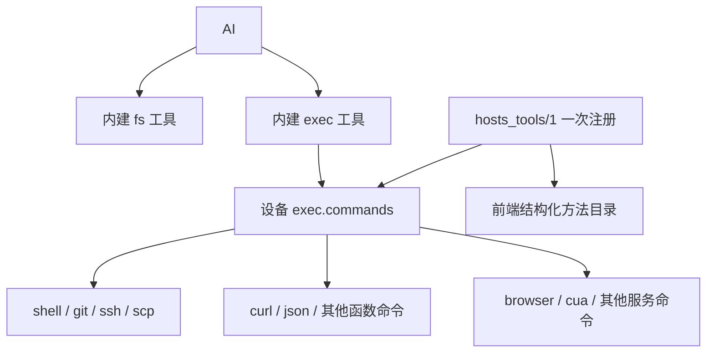
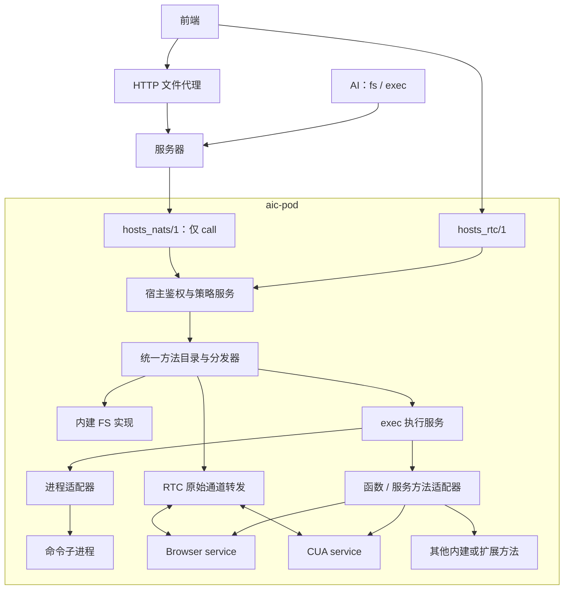
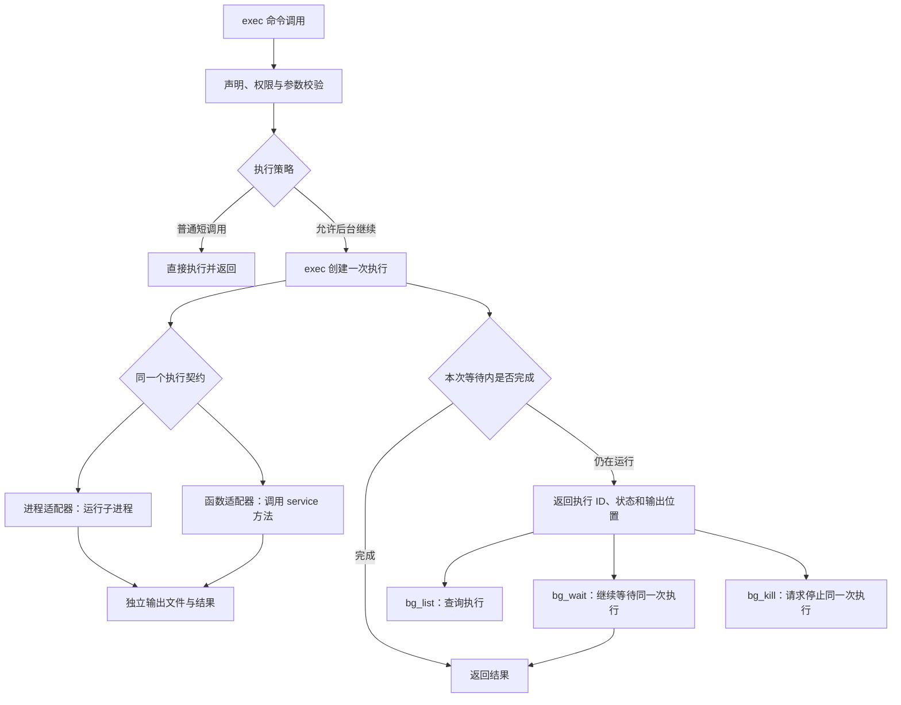

# 设备能力统一设计：fs + exec 与三个协议

修订：2026-09-21。本文对应已实施的统一架构；调用格式、配额和验证范围见 [hosts-tools.md](hosts-tools.md)。本次修正此前将 `caps.tools` 与 `fs`、`exec` 并列的设计，不保留旧协议兼容入口。

## 1. 对外能力模型

AI 始终使用内建 `fs` 和 `exec`。Browser、CUA、shell、git 以及以后注册的扩展，都是 exec 子命令。`hosts_tools/1` 是设备内部的实现与注册契约，不是第三类 AI 工具，也不要求增加 `caps.tools`。



能力声明只保留两类业务能力：

```text
caps.fs                 内建文件操作声明
caps.exec.commands      全部可执行命令：名称、方法、CLI、schema、权限、执行约束
caps.transports         RTC/NATS 等实际可用的承载信息
```

同一份命令注册同时生成 `exec.commands`、AI 命令帮助、argv 翻译和前端方法描述。AI 可见目录只列 call，前端目录可额外列出 stream；它们是同一目录的过滤结果，不单独维护另一份注册。`fs` 保持内建身份，其方法声明也能复用同一套 typed binding、校验和宿主授权设施。

## 2. 三个协议与完整调用关系

| 协议 | 职责 |
|---|---|
| `hosts_tools/1` | 内建能力与扩展命令的本地接口契约：方法声明、typed call、stream、可信上下文；扩展归入 exec |
| `hosts_rtc/1` | 前端到设备的认证、call/cancel 和原始双向 stream 绑定 |
| `hosts_nats/1` | 服务器到设备的签名、路由、防重放和 call/cancel；不承载 stream |



HTTP proxy 是前端经服务器访问设备的转发入口，不新增 `hosts_proxy/1`。服务器转成 `hosts_nats/1` 调用，同一个 FS 实现处理。调用者身份来自认证结果；人类代理不伪装成 AI session。文件代理现有 fs-only 范围须作为可信授权约束保留，不能因接入统一分发器扩展成任意命令权限。

调用体区分内建 fs 与 exec 命令。以下是调用体示例：

```json
{"domain":"fs","method":"stat","args":{"path":{"root_id":"root","segments":["Users","example","note.txt"]}}}
```

```json
{"domain":"exec","command":"browser","method":"page.observe","args":{"page_id":"p_123"}}
```

CLI 请求仍可携带 `command + argv`；服务方法由一次声明翻译成 typed 参数。shell、git 等保留原始 argv 数组，进程适配器传给相应程序，不要求把所有 CLI 参数改成固定业务字段。结构化输入与 argv 是互斥的两种表达，最终进入同一方法。

握手、票据、请求 ID、nonce、认证有效期属于接入层。页面 ID、窗口 ID、文件版本属于相应能力的业务参数。`ui/1`、FS 路径与版本模型可以作为内部约定保留，不升级为宿主标准协议。

## 3. 三种实现形式，共用一次执行接口

命令的实现形式与是否后台执行是两个独立问题。

| 实现形式 | 一次执行的实际工作 | 长期状态 |
|---|---|---|
| 进程命令 | 启动 argv，等待该子进程，读取退出状态 | 该执行拥有的进程与输出 |
| 函数命令 | 调用 Go 函数，接收返回结果 | 通常无长期服务状态 |
| 服务命令 | 调用已存在或懒启动的 service 方法 | service 自管页面、窗口、驱动、refs 等 |

`hosts_tool.RegisterCommand` 表示注册一个 exec 命令；进程适配器、函数适配器、服务方法绑定都产生同一种命令描述。service 在设备工作区内创建一次，不随每次请求、RTC 连接或后台执行重新创建。注册代码可以捕获 service 实例，不要求 service 实现一种通用业务 session。

执行函数的语义接口可以是：

```go
// 概念示意；typed Bind[A,R] 隐藏参数编解码。
type RunContext struct {
    Caller Caller     // 宿主认证、授权上下文
    Output io.Writer  // 此次执行独享的输出
}

// 进程适配器、普通函数、service 方法都能适配到这个签名。
Run(ctx context.Context, run RunContext, args A) (R, error)
```

方法仍只有 `call` 和 `stream` 两种模式。后台执行是 call 的执行策略，不增加第三种 `job` 传输模式。方法可以声明是否允许后台继续；进程执行及可取消的长等待/编排方法通常允许，短查询、控制方法按需使用直接 call。

服务常驻与命令运行时长无关：`browser open` 完成后 Chrome 和页面继续存在；`browser wait` 可以执行一分钟；Browser service 的存活时间不会使每个 Browser 命令都变成后台任务。

## 4. bg_* 统一的是执行，不是服务



exec 内建执行服务维护可后台化执行的记录：执行 ID、所属主体/来源、命令摘要、开始时间、状态、执行期限、取消入口、输出位置和最终结果。它不存储 Chrome 页面、CUA 窗口、FS 上传对象或工具业务 session。

这是现有 `bg_*` 的执行领域状态，放在 exec 内部。接入层仍只保存活动请求与通道转发附件；FS 和其他短 call 不必先创建通用 operation。`commands`、`bg_list`、`bg_wait`、`bg_kill` 自身作为 exec 控制方法直接处理，不递归为自己创建后台执行。

状态只记录执行事实：`running / cancelling / succeeded / failed / cancelled`。foreground/background 表示调用方是否仍在等待，不是两种任务。等待超时后不重新运行 handler、不搬迁任务、不重新启动服务，只把同一次执行的句柄返回。

为了处理回复丢失，可后台化执行在发送前确定 execution_id，并由 exec 校验主体、来源及调用摘要；保留窗口内同 ID 不启动第二次执行，不同参数复用 ID 明确拒绝。后续用 `bg_wait` 查询，不能按网络超时重放副作用调用。此去重仅是 exec 执行语义，不是所有 call 的通用 exactly-once 保证；设备重启和记录过期必须返回不可恢复，不能当作从未执行。

首版执行记录只在设备进程内保留并设完成记录 TTL、数量和输出配额，不承诺重启续跑。业务服务只保存一份状态，普通 Browser/CUA 命令的运行状态不再同时维护 `browser.task.*`、`cua.task.*` 和 `bg_*` 三份。

## 5. 输出重定向与 typed 结果并存

| 来源 | 输出处理 |
|---|---|
| 进程 stdout/stderr | 合并写入此次执行的 Output，保留现有行为 |
| 服务方法的进度/日志 | 显式写入此次执行的 Output |
| 方法最终返回值 | 保留 typed result；同时用方法 formatter 写入可读输出 |
| 图片、下载、上传对象 | 保持领域专用读取接口，不塞进文本日志 |

默认输出路径由 exec 在受控目录分配；用户指定路径时照常检查文件权限和覆盖策略。每次执行有自己的 Writer，禁止通过切换进程全局 stdout/stderr 来截获并发服务调用。

直接响应和 `bg_wait` 使用一致的完成结果，包含 status、typed result/error、输出位置、有限输出预览及截断标记。进程可额外提供 exit_code；服务方法不伪造进程退出码。stdout 日志不是业务状态来源，也不要求前端解析日志恢复结构化结果。

短调用可以直接返回 typed result；指定输出文件或启用后台托管时接入相同输出设施。完成结果与日志有明确保留窗口和读取授权；输出达到配额时按声明截断或停止，并明确标记，不能静默无限增长。

## 6. 等待、执行期限与取消必须分开

| 控制项 | 含义 |
|---|---|
| wait_ms | 此次 call / bg_wait 最多等多久；耗尽不等于执行结束 |
| timeout_ms | 此次执行最长存活时间；耗尽发起取消 |
| admission deadline / nonce | 请求是否还允许入场；不能与后台执行期限共用 |
| authorization validity | 已授予执行的有效范围和期限；不能因后台化自动延长 |

允许后台的执行在宿主授权后创建独立运行 context，等待回复使用独立等待 context。后台执行期限需由签名请求及设备策略允许，不能仅用 `context.Background()` 绕过授权期限。短期传输票据过期不应无意取消合法后台工作，也不能用一次已过期授权永久继续操作；宿主保存执行所需的可信授权，并执行撤销、过期及敏感步骤复查。

- 普通短调用：执行超时/显式取消会通知 handler 结束，不保证动作回滚。
- 允许后台继续的执行：wait 超时或等待者断开只结束等待；执行超时、授权失效、设备退出或 `bg_kill` 才停止执行。
- `bg_wait` 超时、关闭前端等待窗口，不等于 `bg_kill`。
- 进程取消：终止此次执行拥有的进程树并等待退出，保留现有沙箱和权限规则。
- 服务方法取消：调用 context/驱动支持的取消或停止逻辑，保留 service、其他页面及其他执行。
- Go 函数不能被安全强杀；driver 也未必能撤回已派发动作。必须到 handler 实际退出/驱动确认后才标记 cancelled；必要时由服务把相应业务对象标记 uncertain，拒绝冲突写入。不得为停止一个等待直接杀掉共享 Chrome/CUA 服务。

`bg_kill browser wait` 仅取消等待，不关闭浏览器；取消 `download.wait` 不等于取消浏览器下载。后者需要显式调用 Browser 的 `download.cancel`。执行任务与业务对象的生命周期在这里保持清晰。

## 7. 服务内部并发与编排

exec 统一执行预算、身份、输出与 bg 查询；每个命令实现自己的业务并发规则。Browser 按页面调度写操作、跨页并行；CUA 按窗口/前台输入约束调度。不能为了统一 exec，把整个设备的 Browser/CUA 都串成一条队列。

服务排队中的调用响应取消；直到底层操作真正结束才释放相应业务互斥条件。`bg_*`、弹窗处理等控制路径不能排在正等待它们的工作后面。

以后需要 `browser run` 或通用编排命令时，一个流程对应一次 exec 执行。脚本子步骤通过同一授权分发入口调用方法，继承此次执行的取消、输出和权限预算；无需给每个步骤再创建后台记录。除非明确请求独立后台工作，否则不递归创建任务。本文不把尚未接入的 script worker 描述为现有可用命令。

## 8. stream 与文件代理

stream 仍然是仅前端 RTC 可用的双向异步原始通道，与 `bg_*` 完全独立。Browser viewer 的 frames/input 不创建 exec 后台任务，也不采用逐包 call/ACK。FS 上传下载的消息格式、校验、续传由 FS 自行负责。服务决定关闭流后的业务清理，宿主只鉴权、转发和关闭通道。

NATS 和 HTTP/NATS 文件代理维持 call：文件可以通过有界范围读写完成传输。范围读写是实际 FS 操作，不假装建立了一个 duplex stream。以后若有大文件中转吞吐要求，应单独评估数据承载，不能默默给 NATS 增加通用流协议。

FS 内建服务统一前端和 AI 的底层文件实现、权限与版本检查；AI 的文本编辑/搜索与前端的二进制读写可以有不同方法，但不重复维护两套文件执行器。FS 自己保有必要的上传/下载状态，不要求它采用 exec 的后台记录。确有长目录任务需求时先在 FS 内明确生命周期，可复用执行库而不伪装成 exec 命令。

## 9. 状态归属

| 所属模块 | 保存内容 | 不负责的内容 |
|---|---|---|
| RTC/NATS adapter | 认证连接、活动请求、流转发附件 | 任务事实、页面、文件资源 |
| 宿主授权服务 | 主体、策略、grant、撤销与有效期 | 页面/窗口业务会话 |
| exec 执行服务 | 允许后台的命令执行、取消、输出、结果 | Browser/CUA 服务业务状态 |
| Browser | Chrome、页面、refs、下载、人工输入状态 | 另一份通用 bg 命令目录 |
| CUA | driver、窗口、快照与输入状态 | 另一份通用 bg 命令目录 |
| FS | 文件权限校验、版本、传输暂存与恢复状态 | 所有工具的通用资源注册表 |

来源中的 AI session ID 可以用于授权范围、输出目录和 bg 列表过滤。它不是要求前端也创建的设备通用 session。不同通道通过可信主体与来源访问获准的执行，ConnectionID 不作为持久业务任务的所有者。

## 10. 实施顺序与验证

已实施：`libs/exec_procs` 同时提供进程 `Start` 与非进程 `StartTask`，后者接受 `Run(ctx, io.Writer)` 并支持超时返回后台 ID。本次复用这一能力，扩展 typed result、取消状态、授权生命周期、配额和记录保留，不另建一套与 bg 并列的 tasks API。

1. 重整 `hosts_tools/1` 目录：保留 fs 内建身份，全部扩展只注册为 exec 命令；删除 `caps.tools` 及服务器合并目录的特殊分支。完善方法描述，保留 CLI 原始 argv 与 typed 参数两类适配。
2. 抽出独立宿主鉴权与统一调用体，去除新 RTC 对旧 CommandService 的依赖；RTC/NATS 共用 fs/exec 分发。
3. 在 exec 内复用并扩展现有执行管理器，接入进程和函数/服务适配器。先验证 shell 与一个可取消的 Browser 长等待使用同一 `bg_*` 和输出机制，再迁入其他命令。
4. FS 与 proxy 共用内建 FS 实现；处理文件版本、传输配额和恢复的业务归属后，删除旧 hostcmd 的通用 session/operation/resource/stream 状态链。
5. 同步服务器、前端 SDK、caps、AI help、权限检查、测试和文档；清理旧 hosts/1、旧 live 通道及遗留注册路径。不保留历史兼容入口。

验收：AI 只有 fs/exec；一次注册同时供 AI 命令与前端 typed 调用；普通 call 不强制开会话；两个实现形式都可后台并输出到指定文件；等待超时不会重新执行；取消服务任务不关闭共享服务；typed 结果不依赖日志反解析；后台授权不因传输断开或续连被错误延长；viewer stream 不进入 bg；FS 保持内建身份；代码无额外 caps.tools 合并分支。
