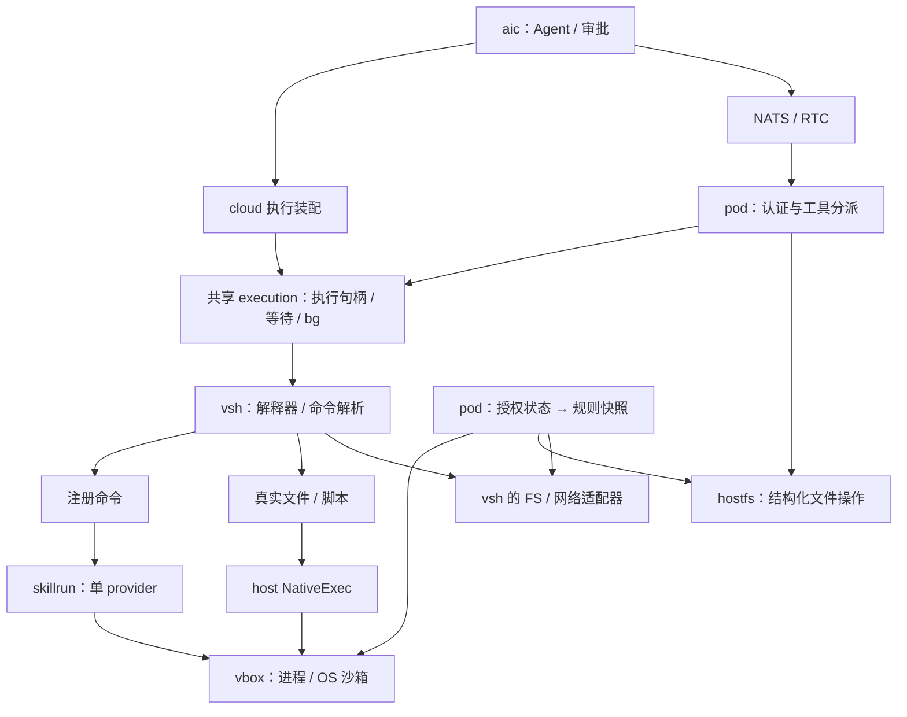

# AIC 公开发版前架构简化方案

日期：2026-10-03。状态：六项结构调整已实施，本机回归完成；发版前的未通过项和实机验收范围见 §11。

基于当前工作区的 aic、aic-pod、aic-skills、vsh、vbox 实现。本次直接定义公开版结构，不保留旧配置、旧 manifest、旧协议、stub 或双路径执行的兼容层。本文记录公开版结构与验收标准；末尾记录验证范围与平台限制。

## 1. 设计结论

保留五个仓库，减少仓库内部和仓库之间重复承担的职责。此次不重写 shell，不增加公共框架，不拆新服务。

核心收敛为六项：

1. **命令不再伪装成文件。** 注册命令直接按名称解析，真实文件通过文件系统解析，原生程序通过显式注入的执行函数启动；删除整套 stub 和配套布局维护。
2. **权限只有一套判定语义。** fs/net/ssh 的解析和匹配归 vbox；pod 只管理配置、授权和快照。配置、界面和执行全部首命中生效。exec 同时改为单张规则表，删除第二份 native 白名单状态。
3. **任务和服务分别管理。** `bg` 管理会话执行；skill service 由 skill 包管理，与首次调用者的 session、bg 配额无关。
4. **skill 只有一条安装路径。** 下载包、内置包经过同一套校验、暂存和切换；删除直接覆盖目录的安装实现。
5. **每个 skill 只有一个 provider。** 保留 process/service 两种实际需要的运行方式，删除 provider ID、默认 provider、多 provider 编排和 stream 路由表。
6. **一条连接只承载一次调用或一条流。** 删除连接内请求 ID、多路复用、取消帧和 demux；连接关闭就是取消。

衡量标准是：同一问题只有一个实现入口；新增命令不需要创建文件；新增 skill 不需要修改宿主分派；维护者能从入口直接找到执行和权限判定的位置。

## 2. 仓库和运行边界

| 仓库 | 保留职责 | 不承担的职责 |
| --- | --- | --- |
| aic | Agent、会话、审批、技能发布、云端装配、前端 | 设备进程管理、第二套 shell 或技能运行器 |
| aic-pod | 设备认证与连接、执行装配、授权状态、skill 安装和运行 | shell 语法、重复的规则匹配算法 |
| aic-skills | 官方技能、构建产物、provider、最小 SDK 和包格式 | pod 会话、审批、bg、设备配置 |
| vsh | shell 解析与解释、管道、注册命令、命令解析、FS/网络抽象 | skill 安装、业务授权状态、直接启动宿主进程 |
| vbox | fs/net 规则解析与求值、OS 沙箱、原生进程生命周期 | Agent、会话审批、skill manifest、shell |



图中 skill/native 分支仅由提供相应能力的端装配。cloud/page 不注入宿主原生执行能力；底层 vsh 默认也不提供它。vsh 与 vbox 不相互依赖，由 pod 连接。

NATS 与 RTC 继续共用工具分派，分别保留自己的传输和取消行为。结构化 `fs` 的版本校验、文件句柄和条件提交继续放在 hostfs；shell 文件操作继续使用 FS 适配器。两者共用规则求值，不强行合并成一套文件 API。

## 3. 去掉 stub：命令模型

### 3.1 三类命令，两个解析阶段

| 类型 | 示例 | 真相来源 | 执行方式 |
| --- | --- | --- | --- |
| 解释器内建 | `cd`、`export`、`read`、`command` | 解释器实际支持的内建集合 | 解释器直接执行，能够改变当前 shell 状态 |
| 注册命令 | `ls`、`jq`、`browser`、平台 `bg` | `commands.Registry` | 构造 Invocation，执行 Go command |
| 真实文件 | PATH 中的程序、`./script.sh`、`/usr/bin/git` | 当前 FS 中的真实条目 | 文本脚本由相应解释器执行；原生二进制交宿主执行函数 |

alias 展开、POSIX special builtin、function、普通 shell builtin 的优先级继续由解释器管理，遵循当前 shell variant。**删除为了覆盖 builtin 而将 `argv[0]` 改写成 stub 路径的行为。**

解释器需要外部命令时，只进入以下解析流程：

```text
输入：argv、当前 cwd、用于查找的 PATH、当前 FS

命令是显式路径？
  是 → 只解析这个真实文件
  否 → Registry.Lookup(name)
         命中 → 注册命令
         未命中 → 按 PATH 查找真实文件

执行已解析目标，不重新按名称选择另一目标
```

显式路径包括相对路径、绝对路径及平台适配后的 Windows 路径。注册命令不依赖 PATH；PATH 只负责真实文件。`/bin/ls` 不再是虚拟 `ls` 的别名：host 上存在真实 `/bin/ls` 就按真实程序执行，虚拟 FS 中不存在就报错。

Registry 只保存真实注册的名字。删除“任意名字都能合成一个 native Command”的 fallback，也不再靠 `Names()` 反查某个 Lookup 结果是否是真注册。

注册命令一旦命中，禁用、拒绝或执行失败都直接返回，**不能继续尝试同名系统程序**。skill 卸载完成后才移除名字；已禁用 skill 保留注册占位并明确返回禁用错误。

### 3.2 解释器内建与注册命令的关系

以内建实际分派表为准，补全、help、type、安装时的保留字检查共用这一来源，不再使用一个比实际实现更宽的“可能是 Bash builtin”列表。

- `bg` 等当前通过 Registry 实现的平台命令，直接在外部命令阶段命中 Registry，不需要 stub 强制覆盖。
- `cd`、`export`、`complete` 等状态性命令只由解释器实现，删除无独立用途的注册副本。
- `echo`、`printf`、`test` 等确有独立工具语义的实现可以保留：普通 shell 调用走内建，`env printf ...`、`xargs ...` 等外部调用走 Registry。不能为了减少名字重复而破坏两者不同的行为契约。
- skill 包名不能覆盖实际 shell builtin、已有注册命令或其他已安装包。资源型 skill 不占命令名。

不新增“内建覆盖系统”、优先级配置或 command provider 插件链。

### 3.3 一个文件查找实现，一个 native 执行出口

PATH、执行位、Windows PATHEXT、相对路径和文件分类统一由 vsh 的命令解析代码处理，使用注入的 FS。删除 pod native 适配器中的第二次 PATH 查找。

vsh 仅增加一个小的原生执行回调，概念签名如下，实际复用现有 Invocation 和错误类型：

```go
NativeExec(ctx context.Context, resolvedPath string, inv *commands.Invocation) error
```

`resolvedPath` 必须是 vsh 已解析出的绝对文件路径，不能由 `argv[0]` 的展示值或调用方声明的 CommandName 替代。host 适配器负责：

1. 从解析结果取得命令身份，执行唯一的 exec 规则检查。
2. 转换 cwd/env/程序路径到 OS 形态，取得当次授权快照。
3. 调用 `vbox.Manager.RunProcess`，透传 stdio、取消和退出码。

适配器不再拥有 Registry、不存 allow/deny 副本、不再自行寻找另一个可执行文件。`vsh` 内部不调用 `os/exec`；未注入回调时不会启动宿主进程。

查询和执行共享目标解析，但查询不启动 service、不执行程序，也不代表提前获得授权。真正调用时始终重新检查当次授权。查找过程中保留 FS 自身的访问控制。

错误口径固定：目标不存在为 127；目标存在但不可执行、权限拒绝或当前端无对应原生能力为 126；程序已经启动则透传其退出码。PATH 搜索仍遵守“前面的不可执行候选不妨碍后续有效候选”的正常行为。

### 3.4 `command`、`type`、`which`、`hash`

这些入口不能各自重新实现一次 PATH 搜索。解释器保留 alias/function/builtin 的语义，外部目标统一委托同一个解析实现。

| 操作 | 对注册命令 `browser` 的行为 |
| --- | --- |
| `browser ...` | 直接调用注册命令 |
| `command browser ...` | 按 shell 语义跳过 function，再调用注册命令 |
| `command -v browser` | 输出 `browser`，不伪造文件路径 |
| `type browser` / `type -t browser` | 描述为 registered command / 输出 `registered` |
| `type -a browser` | 按实际优先级列出所有类别中的命中，包括真实 PATH 文件 |
| `type -p browser` | 首选结果不是文件时无路径输出 |
| `type -P browser` | 强制只查真实 PATH 文件，不把注册名转换成路径 |
| `which browser` | 输出 `browser`；`which -a` 继续列出真实 PATH 文件 |
| `hash browser` | 注册目标无需缓存；成功但不新增文件缓存项 |
| `hash -t browser` | 没有文件缓存时报告未缓存 |

`which` 的结果是可执行标识；只有真实文件结果才是文件路径。调用方需要文件路径时使用 `type -P`。发现接口不得为未知名字返回一个合成 native 命令。

补全从实际可用的 shell builtin、Registry 和真实文件取名。hash 只缓存真实文件，不能覆盖 Registry，PATH/cwd 变化按既有 shell 语义使相关缓存失效。

### 3.5 嵌套调用与脚本

`env`、`xargs`、`find -exec`、`timeout` 通过现有 `Invocation.Exec` 提交 argv，走相同解析入口。删除这些命令为确认 stub 存在而进行的文件探测。保留有实际语义的字段：查找环境与子进程环境可以不同，替换环境和自定义 argv0 不能被删掉。

宿主环境只在 shell 入口载入，沙箱调用先清洗敏感变量。native/process 启动时使用当次导出的完整环境，避免 `env -i`、`unset` 或取消 export 后重新继承宿主变量。自定义 argv0 只影响子进程参数，不改变已解析的程序身份；Unix 沙箱启动器的限制见 §11。

嵌套调用不把 argv 拼成 shell 字符串再解析，避免引号、空参数、stdin、退出码发生变化。

脚本执行保留以下明确边界：

- `source file` 是读取文件的解释器操作，不需要执行位，也不查 Registry。
- 支持的 shell shebang 作为语言选择由 vsh 处理，如 `#!/bin/sh`；这是脚本解释规则，不表示虚拟 FS 中存在 `/bin/sh` 文件。
- 其他 shebang 保留明确的解释器解析和参数传递：显式解释器路径查真实文件，`env` 形式中的名字走相同外部命令解析；不存在或无法执行时明确失败，不静默退回 Bash。
- 无 shebang 的可执行文本按当前约定使用 shell；二进制走 NativeExec。Bats runner 尚未实现时继续明确报错。
- shell 套 shell 仍走 vsh；用户显式执行真实宿主 shell 文件时走 native 权限和 vbox，不因为名字像 shell 就被重定向成注册命令。

### 3.6 文件系统初始化退回所属端

删除以下配置和机制：

- `BuiltinCommandDir`、`LayoutFS`、仅供布局使用的 `LayoutEnv`。
- stub 生成、标记识别、孤儿清理、chmod 修复、builtin 路径重写。
- `layout_state` 的 dirty/stub/command 追踪、为布局失效而挂的 trace recorder。
- 仅为预制 stub 存在的 prepared FS 克隆和 `layoutReady(commandNames)` 回调。
- host 的 `~/.aic/vsh/bin` 创建，以及仅为躲开布局 mkdir/chmod 的 FS 包装。
- cloud 中仅为 stub 设立的 `/bin`、`/usr/bin` overlay。

Runtime/Session 不再依据 HOME/PATH/Registry 变化修改文件系统。FS factory 创建它实际需要的目录：默认内存 FS 的 home/tmp、host 的工作区和会话目录、cloud 的逻辑根和临时区。Session 只校验并进入 cwd；目录不存在就按调用契约报错。

管道、进程替换和真正的临时文件仍由执行代码按需创建；`/dev`、`/proc` 等已有虚拟能力按实际用途保留。删 stub 不等于删全部虚拟 FS。

不引入内存 stub、伪 URI、隐藏 `/bin` alias 或开关作为替代。历史 stub 不自动识别、不修复，默认 PATH 不再包含其目录；公开版使用新默认数据布局，无运行时迁移器。

## 4. 权限：一份规则，一套求值

### 4.1 配置与执行使用同一顺序

四域统一为 `*_policy + *_rules`。fs 保留 deny/ro/rw，net/ssh/exec 使用 allow/deny；不同域保留各自适合的匹配算法。

```yaml
fs_policy: deny             # 未命中时读允许、写拒绝；不改变现有读写模型
fs_rules:
  - "ro:~/.ssh/known_hosts"  # 例外在前
  - "deny:~/.ssh/**"
  - "rw:~/.cache/**"
net_policy: open
net_rules:
  - "deny:169.254.169.254:*"
ssh_policy: deny
ssh_rules:
  - "allow:github.com:22"
exec_policy: deny
exec_rules:
  - "allow:git"
  - "allow:browser"
```

配置文件第一行就是该组最高优先级，界面按生效顺序显示。永久 grant 插入配置组表头；临时 grant 插入会话组表头。重复授权应确保授权后的最终效果成立，不能因为表尾已有同名 allow 就直接跳过。

生效顺序固定为：

```text
会话临时授权 → 设备配置/永久授权 → 内置规则 → 按需元数据保护 → 便利根 → 默认姿态
```

仅相关域存在的组才参与。cfg 不再逆序，永久 grant 不再追加到文件尾；OS 沙箱为实现同一语义所需的内部输出顺序不属于配置顺序，仍由平台编译器负责。

临时授权仍要求可信审批上下文，可以通过表头覆盖已有规则。grant 的来源不能由脚本环境变量伪造。已启动进程使用启动时快照，不新增动态重写运行中沙箱的机制。

### 4.2 删除重复实现

- vbox 是 fs/net/ssh 规则解析、校验、匹配和命中解释的实现来源。保留必要的平台路径归一化与 glob 行为，不能用较弱实现直接替换后丢掉 Windows 双形态或符号链接语义。
- fsauth/netauth 只保存配置、临时授权和默认规则，构造快照；删除私有 matcher、last-wins 求值、重复编译器。
- grant 的覆盖说明使用同一次快照的命中结果，删除 `LastDenyRow`、`DenyHit` 等独立判断链。
- 删除仅为旧沙箱或响应展示保留的 `WriteRootsFor`、`DenyPatterns` 等投影。grant 返回目标、作用域、最终效果；不要把一个有 deny/ro 洞的规则表说成若干“全可写根”。
- 非法规则、未知变量或编译失败必须返回错误，不能静默跳过，尤其不能丢掉 deny 行后继续运行。配置重载失败保留上一次完整有效配置；首次启动失败则报错。

路径归一化属于路径所在的文件系统：host 可以使用 vbox 的 OS canonical helper；cloud 的逻辑路径由 UFS/jail 解析，不能调用宿主 `EvalSymlinks` 后再匹配。vbox matcher 接收已归一化的目标；open 跟随末段链接，unlink/rename 不跟随末段，适配器明确选择正确目标。

### 4.3 exec 的单一入口

删除 `exec_allow`、`exec_deny`、nativeRegistry 的 `Seed/SetPolicy/IsAllowed` 和 allow/deny map。exec 规则只支持精确命令名；全域行为由 `exec_policy` 表达，不引入 `*`、路径模式或命令分类 DSL。

在 pod 保留一个小的命令判定函数，读取当次配置和会话授权，首命中生效。它用于 `skill` 管理命令、已安装 skill 根命令、skill stream 打开以及 NativeExec。exec 是产品层命令授权，不为统一形态而塞进 vbox 的 OS 沙箱规则。

原生命令身份由已解析程序路径的 basename 得出，Windows 可执行扩展名按统一规则归一；不得信任自定义 argv0。skill 身份就是包名，stream 权限也按所属包检查。名称规则不是二进制来源认证，真实进程的文件和网络约束仍由 vbox 执行。

此次保持权限范围清楚：解释器基础语法和现有核心 Go 工具继续依赖 FS/网络门，不重新增加一层 exec 审批；grant 等平台命令按自身业务授权执行。`skill` 管理入口、已安装 skill 和原生程序受上述 exec 规则控制。

不把不同 OS 的沙箱表达力差异藏进统一接口：不能实施的限制继续明确报错或按已有契约报告限制，不声称三端具有完全相同的内核隔离能力。

## 5. skill：一个包，一个 provider

### 5.1 Manifest

`cli/manifest.json` 改为扁平结构：

```json
{
  "kind": "service",
  "entry": "cli/browser-service",
  "args": [],
  "streams": ["page.frames", "page.input"]
}
```

process 使用同一结构，`kind: process`，不允许声明 streams。只有资源的 skill 不需要 CLI manifest，也不注册根命令。

根命令始终等于包名，子命令和 help 由 provider 自己处理。删除 `providers[]`、provider ID、`Default()`、stream.provider、遍历启动所有 service 和 `SKILLPROC_SOCKET_<ID>` 注入。hello 示例改成单 provider，删除演示用的 process 转发 service 链路。

包名不能含 `.`；stream 名可包含点且包内唯一。外部端点统一为 `<包名>.<stream名>`，按第一个点拆分，例如 `browser.page.frames`。删除全局扫描同名 stream 的兜底，前端、RTC 调用者与文档一起更改。

entry 必须位于安装包内，禁止目录逃逸；保留 artifacts.lock 的下载地址、摘要和路径校验。协议解析拒绝旧字段和非法结构，给出明确错误，不做 providers → 单 provider 的转换。

### 5.2 process 与 service 的生命周期

| 项目 | process | service |
| --- | --- | --- |
| 生命周期 | 一次调用一个进程 | 一个启用包至多一个进程，首次调用/开流时懒启动 |
| 取消 | 当前执行取消，结束进程组 | 关闭当前连接，只取消该调用/流 |
| 授权 | 每次调用检查命令规则，生成当次沙箱快照 | 每次 invoke/open 检查包命令权限 |
| 进程权限 | 沿用每次调用的 vbox 沙箱和可信免沙箱上下文 | 沿用已安装可信设备服务模型，不冒充会话级沙箱 |
| 管理归属 | 当前执行句柄；整段执行可进入 bg | skillrun 的包状态 |

service 不再包装成 ExecHandle、不再调用 TaskTable.Adopt、不再拥有 bg taskID。它不消耗用户 bg 配额，也不归首次调用的 owner/session。服务进程由 vbox Manager 负责启动和回收，skillrun 负责决定何时启动和停止。

一个 service 实例只需 `socket/cancel/ready/done/err` 等直接状态。并发首次调用共享同一次启动与就绪结果；等待者取消只退出自己的等待。启动失败记录并返回给本批等待者，后续新调用可以重新懒启动，不建立自动重启 supervisor 或请求重放机制。

禁用、卸载、更新和 pod 关闭会停止对应 service 并等待实际退出。服务退出会断开其调用和流，并如实报告中断；启用只改状态，下次调用再启动。更新时停止服务不是无感热升级。

process 包禁用后拒绝新调用，已启动的调用保留原取消入口，允许执行完成；卸载和更新遇到活动 process 则返回 busy。pod 关闭仍由进程 Manager 回收全部子进程，不再增加一套按包扫描并杀进程的逻辑。

browser/cua service 沿用设备级权限。传入的 cwd/env 是调用参数，不是宿主授权凭证；不能把 session grant/no-sandbox 标志当作 provider 可自行声明的权力。安装可信设备服务的边界必须在用户文档中写明。

### 5.3 skillproc：连接就是调用身份

保留现有长度前缀 + JSON header + 二进制 payload，不更换 RPC 框架。

```text
普通调用：connect → invoke → frame(stdout/stderr)* → exit → close
双向流：  connect → stream.open → stream.frame* → stream.close → close
取消：    任一方关闭连接；对端取消该连接对应的 context
```

删除 Header.ID、pod 序列号、连接内请求表、stream map、TypeCancel 和按 ID 过滤输出。每条连接只接收一个初始请求，第二个 invoke/open 是协议错误。

保留 stdout/stderr 的区分、写帧互斥、帧大小上限、退出码和错误帧；stdout/stderr 可能并发写入，不能因为去掉 multiplex 就删掉写锁。provider 必须监听连接关闭并取消当前处理，不能等处理自然完成后才发现断连。

普通调用的 stdin 继续放在 invoke payload 中，遵守现有大小上限；此次不扩展为通用流式 RPC。需要长连接双向数据的能力使用明确声明的 stream。

协议版本固定升级为 2，仅接受该版本；删除旧版解码和未来解析分流设想，不做协商。版本字段只用于迅速识别错误构建组合。

**删除请求 ID 时必须保留 provider 的资源隔离。** browser 的 input lease 当前用请求 ID 识别持有者，改用 provider 内部的连接实例标识；每条流独立，断开即释放。不能用空串或全局常量替代。就绪探测建立连接后直接关闭，不得创建业务资源。

## 6. 安装：校验、暂存、切换只有一条实现

只保留一种安装输入：skill ZIP。内置预装和远程下载都交给同一个安装函数。现有目录安装无生产调用需求，直接删除；测试改用 ZIP fixture，不为测试保留第二条产品实现。

流程如下：

1. 读取 ZIP，校验包名、目录、manifest、命令冲突和 artifacts 声明。
2. 在同一安装根内准备 `.next`，解包、下载 artifact、校验摘要、验证 entry、设置执行位和安装记录。
3. 暂存完整成功后才进入切换阶段；切换前再次检查包名和命令冲突。
4. 阻止该包接收新调用。若仍有 process 调用，返回 busy，保留旧包；不实现双版本并行。service 则停止并等待退出，活动连接随之结束。
5. 将旧目录移到 `.old`，将 `.next` 移到正式目录，发布新的包记录及根命令，最后清理 `.old`。
6. 切换失败恢复旧目录和可调用状态；旧 service 后续按需重新启动。

使用一个安装操作互斥锁串行化安装和包管理变更即可，不引入任务调度器或通用事务框架。包表锁仅用于短时间查改状态，不能覆盖下载、进程等待或磁盘复制；其他包的正常执行不被安装锁阻塞。

根命令闭包按包名读取当前记录，避免持有旧 Package 指针。包的调用准入检查与 process 活动计数在同一个短临界区完成，确保“检查无人运行”和“开始切换”之间不会插入新进程。

目录改名只用于同一文件系统内的切换，不宣称跨进程状态和两个 rename 天然构成原子事务。启动扫描处理有限的中断状态：

| 磁盘状态 | 处理 |
| --- | --- |
| 正式目录有效，另有 `.next` | 保留正式版本，清理未提交暂存 |
| 正式目录有效，另有 `.old` | 保留正式版本，清理旧版本 |
| 正式目录缺失，存在有效 `.old` | 恢复旧版本，清理未提交暂存 |
| 首次安装仅有 `.next` | 视为未提交，清理并允许重新安装 |
| 正式目录损坏或其他异常组合 | 明确报告，不猜测激活某个版本 |

Windows 同样必须先等 provider 进程退出再替换可执行文件。停不下来、校验失败或 rename 失败都返回可解释的错误，不能提前销毁可用旧包。停止超时保留旧目录和被跟踪的 service 实例，确认实际退出前不能启动第二个实例，也不能把超时报告成切换成功。

保留内置/公开/私有的来源记录和必要版本判断，它们是产品信息；不增加依赖解析、自动升级编排或多版本包管理。

## 7. 代码组织与装配

将 pod 的 `libs/vsh` 与很薄的 `libs/execwait` 合并为 **`libs/execution`**。它表示应用执行层，避免与核心 vsh 同名；只保留一个包，不再按每种执行方式拆目录。

```text
aic-pod/libs/
  execution/       engine、wait、tasks、可信 context、FS/网络适配器、analysis
  host/            设备装配、认证、工具分派、native 执行回调
  hostfs/          结构化文件协议
  fsauth/          文件授权状态和快照
  netauth/         net/ssh 授权状态和快照
  policy/          小型公共策略入口、exec 规则；不再复制 fs/net matcher
  skillrun/        包表、安装、根命令、process/service 执行

aic-skills/sdk/go/
  skillpkg/        manifest/artifacts 契约与校验
  skillproc/       service 编解码与连接
  ...              现有确实被 provider 使用的辅助包
```

把 `aic-pod/protocol/skillpkg` 移到已有 aic-skills SDK，aic 与 pod 直接引用唯一结构；删除旧位置 alias。内容生产者、发布校验、安装器使用同一份契约，不新建 protocol/common 仓库。

`execution` 内按 engine.go、wait.go、tasks.go、context.go、fs_*.go 分文件即可。Engine 仍每次执行创建独立 shell session，可信 owner/session/grant 信息只通过宿主 context 传递。TaskTable 只负责已转后台执行的查询、等待、取消和保留结果；现有 bg 数量限制不被包装成通用资源调度系统。

装配改成单向顺序：

```text
创建 Registry → 创建 skillrun（直接持有 Registry）
              → 注册本端平台命令 → 创建 Engine → 扫描/预装 skills
```

删除 skillrun 为取得 engine.Registry / engine.Tasks 使用的惰性回调。skillrun 不依赖 TaskTable；Engine 接收已经建立的 Registry。平台命令只注册本端实际支持的能力，cloud 专属命令不要在 host 注册一个 nil 回调再报不可用。

core Registry 使用明确的注册冲突处理，不增加 ServiceLocator、容器、事件总线或新的 runtime 抽象。

## 8. 实施批次与删除清单

各批次是代码审查和验证单位，不是运行时兼容阶段；全部完成后统一发布五个仓库的匹配版本。

| 批次 | 修改重点 | 必须随之删除 |
| --- | --- | --- |
| 1. 权限 | vbox parser/matcher 收敛；配置全域 first-wins；exec_rules；前端设置/grant 同步 | pod 私有 matcher、last-wins、cfg 逆序、native allow/deny/Seed、旧配置键 |
| 2. 命令解析 | 解释器与 Registry 边界、真实文件解析、NativeExec、查询和嵌套调用统一 | stub 路径重写、marker、LayoutFS/BuiltinCommandDir、布局修复状态、native Lookup/PATH 副本 |
| 3. Skill | 单 provider manifest、SDK 契约归位、service 脱离 bg、单连接协议 | provider ID/Default、ensureServices、service TaskTable、ID/cancel/demux、裸 stream 名查找 |
| 4. 安装与装配 | 唯一 ZIP 安装、停止后切换、恢复规则、execution 包合并、直接注入 Registry | 目录安装、旧包闭包、Registry/Tasks 惰性回调、无能力平台命令 |
| 5. 发版收口 | 构建官方技能、端到端验收、文档及默认数据更新 | 测试专用历史 wrapper 识别、失效测试脚本、旧接口 alias、兼容开关和旧文档入口 |

stub 删除涉及的当前主要位置：

- vsh：`internal/shell/core.go`、`internal/shell/interp/{runner,builtin,handler}.go`、`internal/builtins/{subexec_helpers,which}.go`、`internal/runtime/layout*.go`、`session_factory.go`、`observability_runtime.go` 及公共配置。
- pod：`libs/host/{engine_vsh,native}.go`、`libs/vsh/{engine,fs_host,fs_ufs}.go`，后者随 execution 包重组移动。
- aic：cloud/page 装配、环境/PATH 默认值、权限设置、skill stream 调用者和提示文档。

修改前通过引用搜索确认删除边界；管道、临时文件和真实 shell conformance 不能因为碰巧使用了旧 helper 就整体删除。测试里的 stub 路径预期改成新契约，历史 harness wrapper 适配优先移入测试，只有无实际测试价值时才移除。

## 9. 验收条件

### 9.1 stub 清零后的命令行为

- 空的可读 FS、只读 FS 中，Registry 命令均能执行；创建 Session、修改 HOME/PATH、安装/移除注册命令不会为布局产生 mkdir/write/chmod。
- 同名 function、解释器 builtin、Registry、PATH 文件按定义优先级执行；`command`、`builtin`、禁用 builtin 和 shell variant 行为分别验证。
- `command -v`、`type` 各选项、`which -a`、补全和 `hash` 不出现虚构路径，不把未知命令报告为存在。
- `env -i`、自定义 argv0、空参数/含空格参数、`xargs`、`find -exec`、`timeout`、管道和重定向仍正确透传。
- 显式真实路径、可执行文本、支持/不支持 shebang、原生二进制、缺失文件分别验证 stdout/stderr 和 126/127；host、cloud 的能力差异明确。
- host 的 PATH/Windows PATHEXT 只有一个实现来源；Registry 命中后拒绝或禁用，不能回退到同名 OS 程序。

### 9.2 权限与并发生命周期

- 配置显示顺序、快照顺序、实际命中行和 grant 结果一致；配置移除 allow 后 native 权限立即收回，不受历史 Seed 影响。
- 读、写、删除链接、跨链接 rename、Windows 路径双形态、cloud 逻辑路径和非法规则有针对性回归；内核约束在相应 OS 上实测。
- service 跨 session 复用，不进入 bg 列表、不占配额；多个首次调用只启动一个进程；一个等待者/连接取消不影响其他连接。
- provider 断连取消有效；browser input lease 每连接隔离并释放；pod 退出、禁用、更新能等待服务回收。
- 安装分别覆盖校验失败、artifact 失败、运行中 process、停服务失败、rename 失败以及表列中断状态；失败后旧包仍可恢复使用。
- browser/cua 真正通过 pod/RTC 完成一次调用、开流、取消和重连；hello 示例与官方构建不再依赖多 provider。

### 9.3 发版结构检查

- 代码和构建产物不再引用 stub、旧配置键、providers 数组、skillproc ID、旧包 alias。
- 每个 matcher、PATH 查找、exec 判定、安装提交都只有一个实现入口；service 不引用 TaskTable。
- 保留实际有价值的 shell/OS 回归测试，先运行相关包测试，再运行跨仓库构建和端到端用例；无法在本机验证的平台明确列出，不能用编译通过代替实测。
- 更新 vsh 的 SPEC/FORK/README/AGENTS：SPEC 成为当前契约，FORK 只说明来源和必要差异；修复不存在的 make target 或测试脚本引用。
- `aic/docs/permission_rules.md`、`aic/docs/skill.md` 成为对应产品行为的单一文档入口；旧 proposal、重复 as-built 说明合并或删除。本文实施完成后只保留决策依据和有效边界，不继续维护第二套现行契约。

最终开发路径应当直接可见：**加 Go 命令只注册，加 skill 只交一个包，改权限只改规则，加设备原生能力只装配执行回调。** 不再要求开发者理解 stub 生命周期、两套权限顺序、provider 选择或 service 为什么占用了某个 session 的后台额度。

## 10. 实现入口

本方案的主要判断来自以下代码，而非只根据仓库名称划分职责：

- [vsh 命令解析](../../vsh/internal/shell/core.go)、[解释器真实 builtin 集合](../../vsh/internal/shell/interp/builtin.go)、[FS factory](../../vsh/internal/runtime/filesystem.go)。
- [pod 执行装配](../libs/host/engine_vsh.go)、[NativeExec](../libs/host/native.go)、[fs 快照](../libs/fsauth/snapshot_vbox.go)。
- [skill 包状态](../libs/skillrun/registry.go)、[ZIP 安装](../libs/skillrun/download.go)、[service 生命周期](../libs/skillrun/service.go)。
- [共享 manifest](../../aic-skills/sdk/go/skillpkg/skillpkg.go)、[service 协议](../../aic-skills/sdk/go/skillproc/skillproc.go)、[browser provider](../../aic-skills/browser/provider/service/main.go)。
- [当前权限规则契约](../../aic/docs/permission_rules.md)、[当前 skill 契约](../../aic/docs/skill.md)、[vbox 规则模型](../../vbox/fsrule.go)。

## 11. 实施与验证记录

### 11.1 已落地的结构

- 删除 stub 布局、路径重写、marker 和修复状态；Registry、真实文件和 NativeExec 各自承担明确职责。查询、补全、嵌套调用共用查找实现。
- fs/net/ssh 使用 vbox 的解析与匹配，pod 保留授权状态及快照；exec 改为首命中的 `exec_rules`。配置、界面、临时与永久 grant 已同步。
- manifest 校验移入 `aic-skills/sdk/go/skillpkg`；每包一个 process 或 service provider。skillproc 只接受 v2，每连接一次 invoke 或一条 stream，关闭连接即取消。
- service 按包懒启动，共享就绪结果，脱离 bg。禁用、更新、卸载和关闭等待退出；停止超时保留目录与实例，不提前启动替代进程。
- 仅保留 ZIP 安装，采用校验、暂存、停服务、目录切换及有限恢复；损坏的正式目录不自动用备份覆盖。旧根命令按名称读取最新包记录。
- `libs/vsh` 与 `libs/execwait` 合并为 `libs/execution`；Registry 直接注入。官方 browser/CUA、hello 示例、创建技能模板及前端流端点同步到新契约。

没有增加兼容层、依赖注入容器、通用服务管理器或新的跨仓公共框架。实际契约继续维护在 §10 链接的对应仓库文档中。

### 11.2 本机验证结果

环境：macOS arm64，Go 1.27；以下命令从五仓库所在工作区运行。进程、socket、监听端口和沙箱相关测试使用允许这些操作的执行环境。

| 验证 | 结果 |
| --- | --- |
| 五个主模块 Go 回归 | 101 个测试包通过，34 个包无测试；明确排除缺少固定 oracle 的 GNU diff 对照测试 |
| `go vet`，五个主模块 | 通过 |
| `-race`：skillrun、execution、skillproc | 通过 |
| 前端：host tools、权限设置、browser UI | 39 项通过，0 失败、0 跳过 |
| browser/CUA 真实构建后嵌入 pod，测试 skillrun 与 CLI | 通过 |
| Linux amd64 交叉编译 | aic、aic-pod、aic-skills、vsh、vbox 通过 |
| Windows amd64 交叉编译 | aic-pod、aic-skills、vsh、vbox 通过；未将云端 aic 计入 Windows 验证 |
| 独立 contrib/jq 模块 | 既有错误文本断言失败 1 项；明确排除该项后，其余测试通过 |
| 五仓库 `git diff --check` | 通过 |

主要复现命令：

```sh
# VSH_CONFORMANCE_RIPGREP 指向本机 ripgrep 15.1.0。
VSH_CONFORMANCE_RIPGREP=/opt/homebrew/bin/rg go test -p 2 \
  ./aic/... ./aic-pod/... ./aic-skills/... ./vsh/... ./vbox/... \
  -skip '^TestDiffMatchesGNUDiff$' -timeout 4m

go vet -p 2 ./aic/... ./aic-pod/... ./aic-skills/... ./vsh/... ./vbox/...

go test -race -p 2 ./aic-pod/libs/skillrun ./aic-pod/libs/execution \
  ./aic-skills/sdk/go/skillproc -timeout 3m

node --test aic/ui/hosts/tools.test.js aic/ui/settings/page_rules.test.js \
  aic-skills/browser/ui/*.test.js

# 在 aic-pod 目录运行，真实构建 provider 后使用 Go overlay 嵌入：
go run ../aic-skills/cmd/build -command test -- -p 2 ./libs/skillrun ./cli
```

额外回归覆盖：Registry 不写布局文件、显式路径不回落注册命令、真实 native 身份与 argv0 分离、环境清空不重新继承、无效规则保持旧快照、并发首次调用只启动一个 service、断连取消、运行中 process 阻止更新、旧命令句柄读取新包，以及安装中断的目录恢复。测试夹具现在主动关闭 Registry 与 Manager；最终回归未遗留本轮创建的 provider 进程。

### 11.3 未通过项与验证边界

1. **jq 既有断言失败**：`TestJQSupportsStreamErrorsMode` 在 Go 1.27 下得到 `unexpected end of JSON input ... column 7`，测试期待另一错误文本及 `column 8`。旧版 FORK.md 已记录上游原检出同样失败，本次再次复现；没有修改 jq 实现或放宽断言来计为通过。
2. **GNU diff oracle 未测**：本机没有测试要求的 GNU diffutils 3.12，`TestDiffMatchesGNUDiff` 显式排除。不能据此宣称完整 GNU conformance。
3. **实机与交互验收未完成**：Linux/Windows 只做了交叉编译，没有在相应 OS 上执行内核沙箱回归；本轮未完成真实 Chrome/CUA 经 pod/RTC 的完整图形交互、取消与重连验收。自动化 provider、流桥接和前端测试不替代这项发版前检查。
4. **argv0 的明确限制**：注册 shell 和直接 native 启动支持自定义 argv0，Windows 受限令牌路径也接受该字段；Unix 沙箱包装暂不支持时明确返回错误，不静默忽略，也不取消沙箱。后者是已声明的平台边界。

本记录确认结构重构和上述自动化检查已完成，不代表全部公开发版验收项已经通过。发布时五仓库必须使用这套匹配的新契约；旧 manifest、旧 exec 配置键和 skillproc v1 不在支持范围内。
